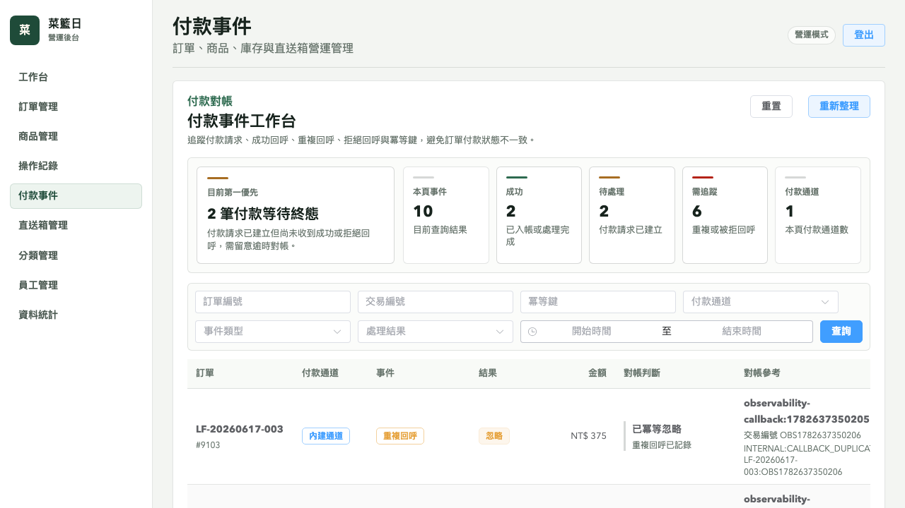
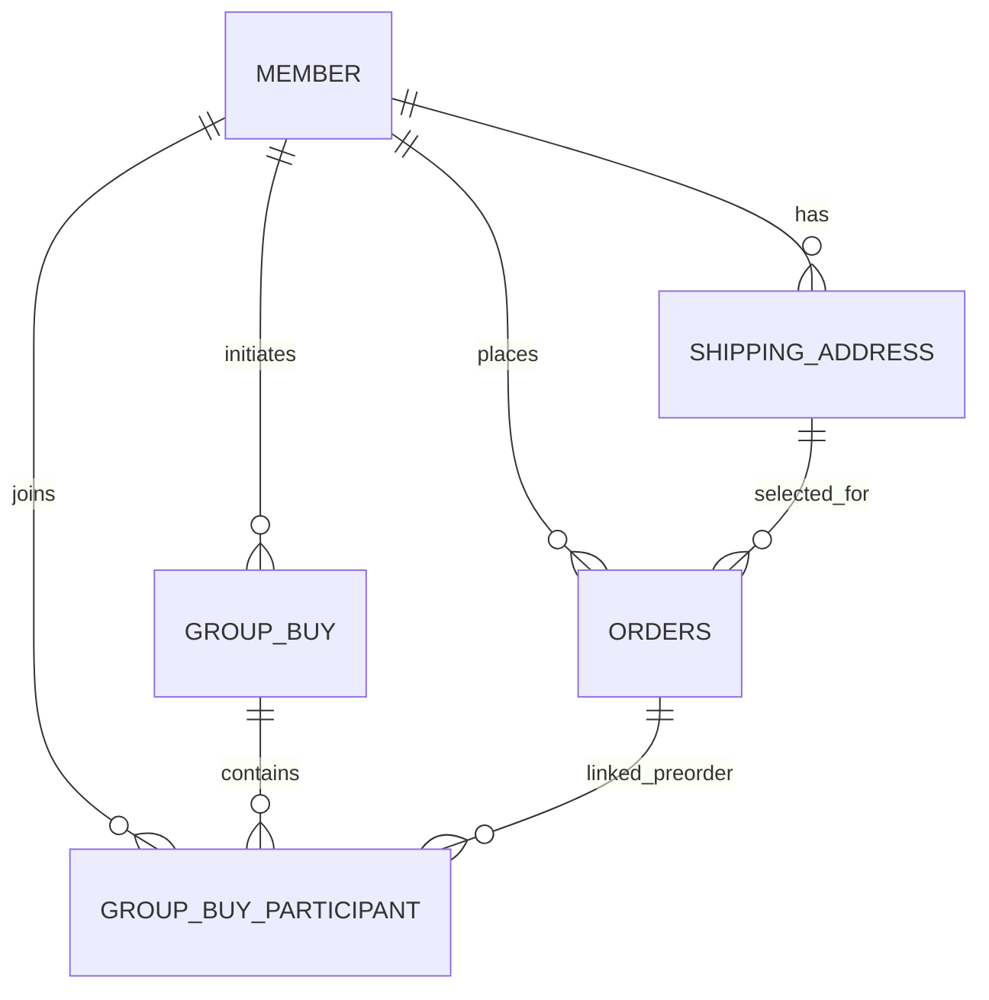
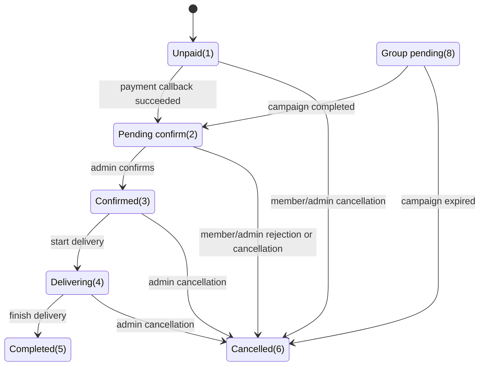
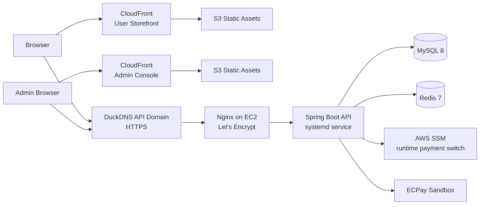

<p align="center">
  
</p>

<h1 align="center">Local Fresh Platform</h1>

<p align="center">A B2C grocery platform combining local farm-to-table delivery with group-buy promotions</p>

<p align="center">
  <a href="https://github.com/kevinlin000/local-fresh-platform/actions/workflows/ci.yml"></a>
  
  
  
  <a href="LICENSE"></a>
  <a href="SECURITY.md"></a>
</p>

**Demo URL**

User storefront

[https://d3hqnux25iirgl.cloudfront.net](https://d3hqnux25iirgl.cloudfront.net)

> The user-facing storefront is publicly accessible. Members can register or sign in with email/password, use Google OAuth, or use the dev-mode mock login for repeatable demo flows.

Admin console

[https://d3czahyk4cnvb9.cloudfront.net](https://d3czahyk4cnvb9.cloudfront.net)

> The admin console is a Vue 3 + Vite + Element Plus operations surface for order handling, product operations, inventory checks, categories, delivery boxes, employees, and operational metrics.

- Read-only admin account: `demo_viewer` / `viewonly`. It can inspect demo data but cannot create, update, delete, or change order/product status.
- Full admin credentials are available from the project author for interviews and are not published to avoid write-access abuse.

> Backend API endpoint: `https://localfresh-demo.duckdns.org`
> Deployment topology: Vue 3 storefront hosted on AWS S3 + CloudFront (HTTPS), Spring Boot API on AWS EC2 (Nginx reverse proxy with Let's Encrypt TLS).

## 30-Second Review Path

| What to check | Entry point |
|---|---|
| First impression | Start with the 10 demo-flow screenshots below |
| Storefront flow | Open the user demo and walk through browsing, cart, checkout, and order tracking |
| Admin capability | Log in with the read-only admin account and inspect dashboard, orders, products, payment events, and operation logs |
| Backend design | Read the domain model, order/payment state flow, and AWS deployment topology under Engineering Design |
| Reliability evidence | Review concurrency testing, Testcontainers, JaCoCo, payment callback handling, and observability evidence |
| Security boundary | Read [SECURITY.md](SECURITY.md) and verify read-only admin restrictions |

## Demo Screenshots

End-to-end flow: storefront browsing → checkout → group buy → order tracking → admin operations → payment reconciliation.

### 1. Home — Market Entry and Shopping Context

The home page is shopping-first: market context, delivery facts, search, category entry points, and the group-buy free-shipping offer as a supporting commerce module.


### 2. Product List — Categories, Filters, Product Cards

The catalog combines category navigation, sorting, price filters, product metadata, delivery status, descriptions, and TWD pricing.


### 3. Product Detail — Product Decision and Dual Purchase Paths

Price, delivery timing, storage guidance, subtotal, quantity, and the "Add to Cart / Start Group Buy" actions are visible in the first viewport, clearly separating standard checkout from 3-person free-shipping group buy.


### 4. Group Buy Detail — Joining Decision and Share Conversion

Remaining seats, deadline, member progress, share CTA, campaign lifecycle, and open participant slots are shown together so users can decide whether to join or share.


### 5. Cart — Checkout Summary and Delivery Context

Cart items, quantity controls, checkout steps, and a sticky order summary are separated, with delivery confirmation, payment mode, and group-buy free-shipping reminders visible before submit.


### 6. My Orders — Status Timeline and After-Sales Tracking

Order totals, payment state, fulfillment state, item count, and a status timeline are shown together, with unpaid orders able to continue into payment.


### 7. Admin Dashboard — Operational Priorities

The dashboard turns pending orders, payment follow-up, stock risk, offline products, and product coverage into a prioritized operations command center.


### 8. Product Management — Listing Quality and Inventory

The product table supports search, status filters, low-stock filtering, listing-quality checks, inventory adjustment, and inventory logs.


### 9. Order Management — Fulfillment Queue and Next Actions

The admin order page surfaces pending confirmation, delivery, contact, address, and group-buy pre-order signals, then shows the next operational action for each order row.


### 10. Payment Events — Callback Reconciliation and Idempotency Tracking

The payment event page turns rejected callbacks, pending payment requests, successful settlement, providers, and idempotency keys into a reconciliation workspace for tracking callback consistency.



## Overview

Online grocery commerce in Taiwan often runs into two practical problems: small orders are penalized by shipping fees, and many platforms stop at catalog plus checkout without supporting collaborative purchasing. Local Fresh Platform combines local farm-to-table delivery with a 3-person group-buy free-shipping flow. Members can browse individual products and curated delivery boxes, add items to cart, manage delivery addresses, place orders, and track fulfillment. The admin console covers product operations, stock, order handling, payment events, and operation logs.

## Engineering Scope

| Area | Current implementation |
|---|---|
| Transaction flow | Order state policy, payment callbacks, cancellation/refund boundaries, inventory restoration, and admin audit log |
| Payment reconciliation | `payment_event` records payment requests, successful callbacks, duplicate callbacks, and rejected callbacks; ECPay sandbox checkout / OTP return has been verified |
| Concurrency | Redisson lock + transaction + database unique key, backed by Testcontainers Redis and JMeter `100` concurrent join evidence |
| Operations console | Dashboard, fulfillment, products/inventory, payment events, operation logs, and a read-only demo account |
| Deployment | AWS EC2 + Nginx + S3 + CloudFront + DuckDNS; `/actuator/info` reports deployed commit metadata |
| Observability | Actuator + Prometheus + Grafana dashboard artifact + alert rules + repeatable business metric evidence |
| Delivery checks | GitHub Actions backend/admin/user checks, JaCoCo artifact, backend release package, local/browser smoke, README screenshots |

## Architecture

```text
┌──────────────────────┐      ┌──────────────────────┐
│ User Web (Vue 3)     │      │ Admin Web (Vue 3)    │
│ Products / Cart /    │      │ Dashboard / Orders / │
│ Group Buy / Orders   │      │ Products / Payments  │
└──────────┬───────────┘      └──────────┬───────────┘
           │ HTTP / JWT                  │ HTTP / Admin JWT
           └──────────────┬──────────────┘
                          ▼
┌──────────────────────────────────────────────────────┐
│             Spring Boot 3.5 Backend API              │
│ Member / Product / Cart / Order / GroupBuy / Payment │
│ Admin Operation / Audit Log / Actuator / Metrics     │
└───────┬──────────────────┬─────────────────┬────────┘
        │                  │                 │
        ▼                  ▼                 ▼
┌───────────────┐   ┌──────────────────┐   ┌──────────────────┐
│   MySQL 8     │   │ Redis 7 + Redisson│   │ Payment Provider │
│ Orders/Payment│   │ Cache / Store    │   │ Demo / ECPay     │
│ Stock/GB/Audit│   │ Status / GB Lock │   │ Callback / Query │
└───────────────┘   └──────────────────┘   └──────────────────┘
        │
        ▼
┌──────────────────────────────────────────────────────┐
│ Prometheus scrape / Grafana dashboard / Alert rules  │
└──────────────────────────────────────────────────────┘

External services:
- Google OAuth 2.0 for member sign-in
- Google Maps API for delivery range checks
- AWS: EC2 (Nginx + Spring Boot + Dockerized MySQL/Redis), S3, CloudFront, DuckDNS
- ECPay sandbox for payment redirect, ReturnURL callback, and provider query parsing
```

## Engineering Design

This section keeps three high-signal design views: core domain model, order/payment lifecycle, and deployed AWS topology. Full table fields, sequence diagrams, index notes, transaction boundaries, and security boundaries are documented in [docs/architecture.md](docs/architecture.md).

### Core Data Model

Group-buy campaigns are not modeled as multiple members sharing one order. The model separates the campaign itself from each participant's own pre-order.



- `group_buy`: stores the campaign identity, initiator, required count, current count, status, and expiry time.
- `group_buy_participant`: connects a member to a campaign and links that participation to the member's own pre-order.
- `orders`: stores `PENDING_GROUP(8)` pre-orders during the campaign window; successful campaigns promote them to `TO_BE_CONFIRMED(2)`, while expired campaigns cancel them.

This keeps delivery address, order amount, and item snapshot separate per participant, while `group_buy_participant (group_buy_id, member_id)` and the Redisson lock prevent duplicate joins.

### Order and Payment State Flow

Order lifecycle rules are centralized in `OrderStatusTransitionPolicy`. Payment success uses guarded updates to advance the order, while payment requests, successful callbacks, duplicate callbacks, and rejected callbacks are recorded in `payment_event`.



### AWS Deployment Topology

The demo uses static frontend hosting plus an EC2 backend. S3 and CloudFront serve the user storefront and admin console over HTTPS; the public API domain reaches Nginx on EC2, which proxies to the Spring Boot service. MySQL and Redis back the domain data, cache, and Redisson locks. The ECPay sandbox provider can be switched through an SSM-backed runtime script.



### Tech Stack

| Layer | Technologies |
|---|---|
| Backend | Java 17, Spring Boot 3.5.14, MyBatis, PageHelper, Flyway, JWT, Spring Security Crypto, HikariCP |
| Consistency | `OrderStatusTransitionPolicy`, transaction boundaries, conditional stock updates, payment callback guarded updates, idempotency keys |
| Payment | Demo gateway, ECPay sandbox CheckMacValue, provider callback, provider query parser, `payment_event`, reconciliation job |
| Observability | Spring Boot Actuator, Micrometer Prometheus registry, Grafana dashboard artifact, Prometheus alert rules |
| Frontend | User Vue 3 + Vite 5, Admin Vue 3 + Vite 8, TypeScript, Pinia, Vue Router 4, Element Plus, ECharts |
| Data/cache | MySQL 8, Redis 7, Redisson distributed lock, Flyway seed data |
| Testing/delivery | JUnit 5, Spring MockMvc, Testcontainers Redis, JaCoCo, Playwright smoke, GitHub Actions, backend release package |
| Deployment/third-party | AWS EC2 + S3 + CloudFront, Nginx + Let's Encrypt, DuckDNS, Google OAuth 2.0, Google Maps API, ECPay sandbox, AWS SSM |

## Core Features

| Feature | Current state |
|---|---|
| Member accounts | Email/password registration and login, Google OAuth 2.0 authorization code flow, dev mock login switch |
| Products and delivery boxes | Category browsing, product detail, curated delivery boxes, real food imagery, component products and value copy |
| Cart and checkout | Quantity control, address selection, notes, packaging fee, stock deduction, order snapshot, order history |
| Group-buy free shipping | Campaign creation, share-and-join flow, 3-member completion, pre-orders, expiry failure, batch promotion to fulfillment |
| Payment and reconciliation | Demo payment, ECPay sandbox checkout/callback, payment event query, pending candidates, provider-query reconciliation |
| Admin operations | Dashboard, order fulfillment, products/inventory, categories, delivery boxes, employees, payment events, operation logs |
| Security demo boundary | Public `demo_viewer` read-only role can inspect but cannot mutate data; full admin credentials are not published |
| Observability | health/info/metrics/prometheus, business counters/gauge, Grafana dashboard, alert rules, live metric evidence script |

## Technical Highlights

### Technical Highlights Overview

| Highlight | Engineering focus | Evidence |
|---|---|---|
| Order state machine | Centralizes payment, cancellation, rejection, delivery, and completion transitions instead of scattering rules across services | `OrderStatusTransitionPolicy`, [docs/testing.md](docs/testing.md) |
| Payment events and idempotency | Handles duplicate, forged, mismatched, and provider-query payment paths through an auditable event trail | `payment_event`, admin payment events page, [docs/ecpay-sandbox-runbook.md](docs/ecpay-sandbox-runbook.md) |
| Group-buy concurrency | Uses Redisson lock, transactions, unique keys, Testcontainers, and JMeter evidence to prevent oversubscription | `GroupBuyRedisIntegrationTest`, [docs/perf/README.md](docs/perf/README.md) |
| Inventory restore idempotency | Combines service guards with inventory-log idempotency keys to avoid duplicate stock restoration | `OrderCancellationServiceImpl`, `product_inventory_log` |
| Read-only admin demo | Public demo users can inspect data while backend authorization blocks admin mutations | `AdminReadOnlyRoleInterceptor`, [SECURITY.md](SECURITY.md) |
| Observability evidence | Triggers real business paths and verifies Prometheus metric increases, not just dashboard JSON | `npm run observability:business-evidence`, [docs/observability.md](docs/observability.md) |
| Deployment and delivery | AWS deployment, ECPay sandbox readiness, GitHub Actions, release package SHA256, local/browser smoke | [docs/backend-deploy-runbook.md](docs/backend-deploy-runbook.md), [docs/testing.md](docs/testing.md) |

### 1. Concurrency control for the group-buy module

The hardest part of the group-buy workflow is preventing oversubscription when multiple members attempt to join the same campaign at the same time. This project uses a Redisson `RLock` keyed by `groupNo` and configured with `tryLock(3, 5, TimeUnit.SECONDS)`: requests wait up to 3 seconds to acquire the lock, while lock ownership is capped at 5 seconds to avoid long-lived contention. Inside the protected section, validation, pre-order creation, participant insertion, count increment, and completion checks are executed as a single transaction. WebSocket notifications are intentionally sent only after the transaction commits, ensuring downstream consumers never observe a stale database state. The implementation is further validated with a 100-thread concurrency test.

### 2. Separating pre-orders from normal order submission

Group-buy orders are modeled as pre-orders instead of reusing the standard checkout path end-to-end. During the campaign window, each participant receives an order with status `PENDING_GROUP`, which avoids prematurely deducting stock, clearing cart state, or triggering the full delivery validation flow. Once the group succeeds, all related orders are promoted in batch to `TO_BE_CONFIRMED`; if the campaign expires, the orders are batch-cancelled and refund intent / cancellation evidence is recorded. This keeps the original order module stable while isolating group-buy concerns in a clear and traceable way.

### 3. Order lifecycle rules backed by service-level tests

Order status transitions are centralized in `OrderStatusTransitionPolicy`, which defines the valid source states and target state for payment, member cancellation, admin confirmation, rejection, cancellation, delivery, and completion. Refunds are not modeled as a separate order status; a refunded order remains cancelled while `pay_status=REFUND` and payment/refund evidence carry the money-movement state. That keeps lifecycle rules out of scattered service conditionals while making the ordinary path and cancellation paths directly testable.

The backend now includes focused tests for `OrderServiceImpl`, `OrderPaymentServiceImpl`, `DemoPaymentGateway`, `EcpayPaymentGateway`, `OrderCancellationServiceImpl`, `OrderFulfillmentServiceImpl`, and `OrderStatusTransitionPolicy`. These tests cover payment request creation, cancelled and pending-group orders that cannot be paid, demo HMAC callback verification, ECPay CheckMacValue verification and callback mapping, payment event recording, duplicate payment callbacks, completed orders that cannot be cancelled, member ownership checks, unpaid rejections that should not refund, gift-box cancellation restoring component product stock, and inventory restore idempotency backed by a nullable `product_inventory_log.idempotency_key` unique constraint. `local-fresh-server` also produces a JaCoCo HTML report with `mvn -pl local-fresh-server -am verify`; see [docs/testing.md](docs/testing.md) for the repeatable command and report path.

Payment processing also writes a provider-neutral `payment_event` trail for `REQUEST_CREATED`, `CALLBACK_SUCCEEDED`, `CALLBACK_DUPLICATE`, and `CALLBACK_REJECTED`. Admins can query that trail through `GET /admin/paymentEvents/page` by order number, provider, event type, result, provider trade number, idempotency key, and time range. A minimal reconciliation endpoint, `GET /admin/paymentEvents/pendingRequests`, lists payment requests that do not yet have a succeeded or rejected callback. The backend now includes an ECPay query-result parser plus a provider-query reconciliation service and disabled-by-default scheduled job, enabled with `PAYMENT_RECONCILIATION_ENABLED=true`; tests cover succeeded, still-pending, rejected, unsupported-provider, unknown-status, query-error, and capped batch-limit paths. The EC2 demo runtime can switch to the ECPay sandbox provider through SSM, and Playwright has verified ECPay stage checkout, OTP payment, ReturnURL HTTP 200, the order moving to paid, and `payment_event` recording `CALLBACK_SUCCEEDED`. The remaining payment work is production-grade monitoring and long-running external-query evidence.

The admin console also includes a Payment Events page, so payment requests, successful callbacks, duplicate callbacks, and rejected callbacks can be inspected without calling the API manually.

The backend also exposes a minimal business-metrics slice through Actuator. It tracks payment callback outcomes, payment reconciliation outcomes, the latest pending reconciliation candidate count, duplicate/applied order cancellations, and group-buy state transitions. The backend now exposes `/actuator/prometheus` in scrape format, includes an importable [Local Fresh Operations Grafana dashboard](docs/grafana/local-fresh-operations-dashboard.json), and ships a local Prometheus / Grafana / Alertmanager compose stack with alert rules plus a repeatable `npm run observability:business-evidence` business-event check; see [docs/observability.md](docs/observability.md) for local query examples, scrape configuration, dashboard notes, alert thresholds, and current boundaries.

### 4. Admin operation audit log

Admin order confirmation, rejection, cancellation, delivery, completion, and manual product inventory adjustments now write to `admin_operation_log`. The log records the action, target type and id, before/after values, reason, operator, and timestamp, so the backend can answer who changed which business object and why. The admin API also exposes `GET /admin/operationLogs/page` for paginated filtering by action, target, operator, and time range; the admin console includes an Operation Logs page for direct review, and `AdminOperationLogApiTest` verifies pagination, filtering, and newest-first ordering from the HTTP layer. This is separate from `product_inventory_log`: inventory logs explain stock movement, while audit logs explain admin accountability.

### 5. Choosing Testcontainers over mocks for lock verification

A mocked Redis client would verify method flow, but not the real failure mode that matters here: concurrent access against an actual distributed lock. For that reason, the group-buy integration tests spin up Redis through Testcontainers and inject host and port dynamically with `@DynamicPropertySource`. This makes the 100-thread test substantially more trustworthy than a pure mock-based approach. The cost is a slightly heavier test setup, but the benefit is stronger evidence that the locking strategy behaves correctly under realistic concurrency.

### 6. JWT-based authentication with ThreadLocal request isolation

Both the admin API and member API use JWT for authentication. Incoming requests are intercepted, the token is parsed, and the current user context is stored in ThreadLocal so downstream services can access it without repeatedly threading member IDs through controller signatures. That design keeps application code clean, but it also introduces a known risk: if ThreadLocal is not cleared after request completion, data can leak across reused servlet threads. This project explicitly addresses that risk and includes regression coverage for the cleanup path.

### 7. Google OAuth 2.0 via Authorization Code Flow

The login system uses Google OAuth 2.0 Authorization Code Flow instead of the deprecated Implicit Flow. The frontend is responsible only for redirecting users to Google and receiving the callback code; the backend exchanges the code for tokens, verifies the `id_token`, and checks token claims such as `aud` and `exp`. The external Google integration is wrapped behind a `GoogleOAuthClient` abstraction, which keeps business logic testable and allows account-linking behavior to be verified independently from the Google SDK implementation details.

### 8. Clear separation between Redisson and Spring Data Redis

Redis plays two distinct roles in this system: distributed coordination for group-buy locks, and conventional KV/cache use cases such as product list caching and store status reads. Instead of forcing both concerns through the same client path, the project uses `RedissonClient` specifically for locking, while `RedisTemplate` is backed by Spring Boot’s standard Lettuce integration for general Redis access. This separation resolved a real compatibility issue around `Tuple` support and also leaves the codebase easier to reason about for future maintainers.

### 9. Built with deployment readiness in mind

The project is structured with deployment realism in mind rather than as a collection of disconnected demos. Database migrations are versioned, environment-specific configuration is separated cleanly, OAuth credentials are kept out of source control, and frontend/backend integration is designed around realistic local-to-cloud transitions. The deployment topology described below is the actual setup serving the demo URL.

### 10. Testing and delivery evidence beyond unit tests

The verification story has three layers. Backend service/API tests cover orders, payment, cancellation, inventory, group-buy, read-only authorization, and operation logs. Real-dependency evidence uses Testcontainers Redis plus JMeter group-buy concurrency. Delivery checks cover `smoke:backend`, `smoke:browser`, `observability:business-evidence`, repository hygiene, README screenshots, and ECPay sandbox readiness. The result is a README whose claims can be rerun through commands, reports, or deployed endpoints.

## Design Decisions Q&A

### Q1. Why is JWT TTL set to 2 hours?

Two hours is a pragmatic balance between security and usability. A shorter lifetime would interrupt ordinary browsing, cart, checkout, and group-buy actions too aggressively; a much longer lifetime would widen the risk window if a token were leaked. Since this platform is centered around transaction-oriented sessions rather than long-running editing workflows, a 2-hour TTL covers realistic user behavior while keeping the exposure window bounded.

### Q2. Why use Redisson instead of implementing a lock with `SETNX` manually?

A hand-rolled `SETNX` lock is possible, but getting ownership checks, safe release, expiration handling, reentrancy, and failure semantics right adds complexity that does not improve the domain model. Redisson already solves those infrastructure concerns, so the implementation can focus on join validation, campaign completion, and transactional consistency.

### Q3. Why process expired group-buys with a scheduler instead of Redis TTL events?

Redis key expiration events look attractive at first, but they require `notify-keyspace-events` configuration and only offer best-effort delivery semantics. That makes them a weak fit for workflows that need stronger guarantees around database state transitions and refund logging. In this system, campaigns last 24 hours, so a once-per-minute scheduled scan is operationally sufficient while remaining easier to reason about, easier to test, and easier to maintain across environments.

### Q4. Why use Testcontainers instead of relying entirely on mocks?

Mocks are appropriate for isolating business logic, but not for validating distributed locking behavior. The point of the concurrency test is to prove that the real Redis-backed lock behaves as expected under contention. Testcontainers provides that realism in a local and reproducible way, without requiring a permanently provisioned shared Redis instance for CI. The tradeoff is heavier test execution, but the confidence gain is worth it for this part of the system.

### Q5. Why migrate the admin app to Vue 3 as well?

The admin console is the main operations surface for this type of system. Without it, the project would miss product maintenance, order fulfillment, payment tracking, and operation logs. It uses Vue 3 + Vite + TypeScript + Pinia + Element Plus to cover login, list pages, forms, order operations, dashboards, and API proxy integration without expanding the UI beyond the core workflow.

### Q6. Why keep email login, Google OAuth, and mock login in the same repository?

Email/password auth is the baseline member account path. Passwords are stored as BCrypt hashes in `member.password_hash`, and successful logins receive the same member JWT used by the rest of the storefront. Google OAuth remains available for third-party sign-in, with code exchange and `id_token` verification handled by the backend. Mock login is gated by environment flags and kept for fast local testing and repeatable demo flows.

### Q7. Why does the admin demo use a read-only account?

Public admin access needs to be inspectable without allowing data damage. Publishing full admin credentials would allow anyone to modify products, cancel orders, or break demo data. The project therefore includes a `READ_ONLY` admin role: users can inspect dashboards, orders, products, payment events, and operation logs, while all write operations are blocked by the backend.

### Q8. Why use `payment_event` instead of only updating order status?

Real payment callbacks can be duplicated, delayed, forged, or inconsistent with local order state. If the system only updated `orders.pay_status`, it would be hard to explain what the provider sent and how the backend handled it. `payment_event` preserves request, success, duplicate, and rejected callback evidence with provider metadata, transaction numbers, idempotency keys, amounts, raw payloads, and processing results.

### Q9. Why keep observability to Actuator + Prometheus + Grafana?

The current observability scope focuses on signals that map directly to operational risk: rejected or duplicate payment callbacks, stuck reconciliation candidates, cancellation idempotency hits, and group-buy transitions. Actuator, Prometheus metrics, Grafana artifacts, alert rules, and `npm run observability:business-evidence` cover that level. Cloud long-running monitoring and alert drills are tracked as follow-up work.

### Q10. Is the JMeter result old evidence, and should it still be included?

Yes, but it should be framed correctly. The JMeter result is not a production capacity claim. It validates one high-risk correctness scenario: 100 members joining the same group-buy concurrently without oversubscription, duplicate participation, or database inconsistency. If performance became the main story, the next step would be multi-endpoint load testing, soak tests, CPU/database metrics, and bottleneck analysis.

### Q11. Why not split the backend into microservices?

The current system is better as a modular monolith. The main complexity is transaction consistency across orders, payment, stock, group-buy, and admin operations. Splitting too early would turn local transaction boundaries into distributed transactions, compensation, retries, and observability overhead. Clean modules, state machines, transaction boundaries, tests, and deployment evidence are more valuable at this size.

### Q12. What is intentionally out of scope right now?

The project does not currently aim for high-availability clusters, a full SRE platform, a production payment contract, or a large CD platform. Those require more infrastructure and operating cost. Current scope keeps the transaction flow, state transitions, payment callbacks, inventory idempotency, group-buy concurrency, deployment boundary, and observability boundary clear. If the system moves toward production-grade operation, next steps are cloud monitoring retention, trace/log correlation, CD automation, and visual regression.

## System Requirements

- Java 17+
- Node.js 22+ (admin uses npm; user storefront can use pnpm)
- MySQL 8.x
- Redis 7.x (Docker is acceptable)
- A Google OAuth client for frontend and backend local development

## Quick Start

### 1. Clone the repository

```bash
git clone https://github.com/kevinlin000/local-fresh-platform.git
cd local-fresh-platform
```

### 2. Prepare backend `application-dev.yml`

Create:

```text
backend-environment/local-fresh-backend/local-fresh-server/src/main/resources/application-dev.yml
```

At minimum, provide the following values:

```yaml
localfresh:
  datasource:
    driver-class-name: com.mysql.cj.jdbc.Driver
    host: localhost
    port: 3306
    database: local_fresh
    username: your_db_user
    password: your_db_password

  redis:
    host: localhost
    port: 6379
    database: 0

  jwt:
    admin-secret-key: your-admin-secret
    user-secret-key: your-user-secret

  aws:
    s3:
      region: your-aws-region
      access-key-id: your-access-key
      secret-access-key: your-secret-key
      bucket-name: your-bucket

  google:
    api-key: your-google-maps-api-key

  oauth:
    google:
      client-id: your-google-oauth-client-id
      client-secret: your-google-oauth-client-secret
      redirect-uri: http://127.0.0.1:5173/oauth/callback

  auth:
    mock-login-enabled: true

  shop:
    address: Taipei City Hall Rd. 1, Xinyi District, Taipei

springfox:
  documentation:
    enabled: false

knife4j:
  enable: false
```

### 3. Start local MySQL / Redis

```bash
cd backend-environment/local-fresh-backend
cp .env.example .env
docker compose up -d
```

The backend uses Flyway and automatically applies migrations from:

```text
backend-environment/local-fresh-backend/local-fresh-server/src/main/resources/db/migration/
```

For a fresh database, no manual SQL step is required. For an existing non-empty schema that does not yet have `flyway_schema_history`, start the backend once with `FLYWAY_BASELINE_ON_MIGRATE=true`, then disable that flag afterward.

If local port `3306` is already occupied, start only Redis and point the backend to your existing MySQL instance:

```bash
docker compose up -d redis
```

### 4. Start the backend

```bash
cd backend-environment/local-fresh-backend
mvn install -DskipTests
mvn -pl local-fresh-server spring-boot:run
```

The install step refreshes sibling module artifacts (`local-fresh-common`, `local-fresh-model`) in the local Maven repository before running the server module directly.

For the first Flyway baseline on a legacy database:

```bash
cd backend-environment/local-fresh-backend
mvn install -DskipTests
FLYWAY_BASELINE_ON_MIGRATE=true mvn -pl local-fresh-server spring-boot:run
```

### 5. Start the admin frontend

```bash
cd frontend-environment/local-fresh-admin
npm ci
npm run dev -- --host 127.0.0.1
```

The admin app defaults to `http://127.0.0.1:5174`, with `/api` proxied to `http://localhost:8080/admin`.

### 6. Prepare user frontend `.env.local`

Create:

```text
frontend-environment/local-fresh-user/.env.local
```

Example:

```env
VITE_GOOGLE_CLIENT_ID=your-google-client-id.apps.googleusercontent.com
```

### 7. Start the user frontend

```bash
cd frontend-environment/local-fresh-user
pnpm install
pnpm dev
```

### 8. Google OAuth setup guide

For the full frontend-side OAuth setup, see:

- [frontend-environment/local-fresh-user/README.md](frontend-environment/local-fresh-user/README.md)

## Deployment

The deployment topology is:

- **EC2** for the Spring Boot API
- **Nginx + Let's Encrypt** on EC2 for HTTPS reverse proxying from the public API domain to Spring Boot `8080`
- **Dockerized MySQL + Redis on EC2** for products, members, orders, group-buy data, cache, and locking
- **S3** for hosting frontend static assets
- **CloudFront** for CDN delivery and HTTPS entry points
- **DuckDNS** for the public backend API domain

> For detailed diagrams and request flows, see `docs/architecture.md`.

## Known Limitations

| Area | Current state | Follow-up |
|---|---|---|
| Payment | Local demos can use the demo gateway; EC2 can switch to ECPay sandbox through SSM, and stage checkout, OTP success, ReturnURL `200`, paid order state, and `CALLBACK_SUCCEEDED` persistence are verified | The project can demonstrate provider callbacks, CheckMacValue, payment events, pending candidates, and reconciliation boundaries; long-running external-query evidence is a next layer |
| Observability | Actuator, Prometheus endpoint, Grafana dashboard artifact, alert rules, and business metric live-increase script are in place | The core business failure questions are answerable; cloud retention, alert drills, and trace/log correlation are follow-up polish |
| UI testing | Main storefront/admin screenshots, responsive basics, and Playwright smoke are in place | Covers key browsing and login paths; full cross-browser visual regression can be added later |
| Database adoption | Fresh databases can apply Flyway migrations directly; legacy non-empty schemas need a one-time baseline | This is a migration adoption concern, not a blocker for fresh local or deployed demo environments |

See also:
- [docs/known-issues.md](docs/known-issues.md)

## Related Documents

- [docs/known-issues.md](docs/known-issues.md)
- [docs/architecture.md](docs/architecture.md)
- [docs/backend-deploy-runbook.md](docs/backend-deploy-runbook.md)
- [docs/ecpay-sandbox-runbook.md](docs/ecpay-sandbox-runbook.md)
- [docs/observability.md](docs/observability.md)
- [docs/portfolio-roadmap.md](docs/portfolio-roadmap.md)
- [SECURITY.md](SECURITY.md)
- [docs/testing.md](docs/testing.md)
- [frontend-environment/local-fresh-user/README.md](frontend-environment/local-fresh-user/README.md)

Before or while switching the deployed API to ECPay sandbox, run:

```bash
scripts/package-backend-release.sh
EXPECTED_DEPLOY_COMMIT=<deployed-commit> \
scripts/check-ecpay-sandbox-readiness.sh
EXPECTED_DEPLOY_COMMIT=<deployed-commit> \
scripts/switch-ecpay-sandbox-ssm.sh enable
scripts/switch-ecpay-sandbox-ssm.sh status
```

The backend CI job also uploads a `backend-release-package` artifact containing
the verified jar, release metadata, SHA256 checksums, EC2 deploy commands, and
runtime templates. Verify it before EC2 sync with
`scripts/verify-backend-release-package.sh <downloaded-package-dir>`.

Before refreshing local screenshots or giving a live demo, run:

```bash
scripts/check-ui-smoke-local.mjs
```

For repository hygiene and evidence checks, run:

```bash
node scripts/check-repo-hygiene.mjs
```

For a real browser smoke pass, start the backend, user storefront, and admin
console, then run:

```bash
npm install
npx playwright install chromium
USER_BASE_URL=http://127.0.0.1:5176 \
ADMIN_BASE_URL=http://127.0.0.1:5177 \
npm run smoke:browser
```

## Current Status and Next Steps

The public demo covers the core loop: storefront shopping, group buy, order tracking, admin operations, read-only admin access, ECPay sandbox evidence, observability business evidence, README screenshots, and CI/smoke verification. For the full follow-up matrix, see [docs/portfolio-roadmap.md](docs/portfolio-roadmap.md).

Completed evidence:

- Group-buy distributed lock evidence: 100 concurrent JMeter joins, `0.00%` error rate, P95 `2847.65 ms`, final DB state `current_count=101 / participant=100`
- Order lifecycle tests: centralized `OrderStatusTransitionPolicy`, service tests for payment, cancellation, rejection, delivery, completion, and inventory restoration, plus JaCoCo report generation
- Minimal business observability: payment callback, reconciliation backlog, cancellation idempotency, and group-buy transition metrics, plus Grafana dashboard, local Prometheus/Grafana/Alertmanager compose, alert rules, and business metric evidence
- UI smoke: Node precheck and Playwright Chromium smoke for storefront/admin login and core pages
- ECPay sandbox checkout evidence: public readiness, CloudFront storefront redirect to ECPay stage checkout, OTP success, ReturnURL HTTP `200`, paid order state, and `ECPAY / CALLBACK_SUCCEEDED / SUCCEEDED`
- Admin read-only role, admin operation audit log, inventory restore idempotency, AWS deployment, Flyway migrations, CI quality gate, and backend release package checks

Follow-up work:

- Cloud long-running observability evidence through Prometheus/Grafana or CloudWatch retention screenshots and alert drills
- Trace ID and structured logging across payment callbacks, order cancellation, and reconciliation jobs
- CD automation with Docker image build, ECR push, and EC2 rolling deployment
- Lightweight visual regression for the README screenshot pages

## License

This project is not open-source.

Source code is available for portfolio and technical review only.

No permission is granted to copy, modify, distribute, sublicense, sell, reuse, or incorporate this project, in whole or in substantial part, into another project without prior written permission.

Third-party dependencies and preserved upstream notices remain under their respective licenses.
