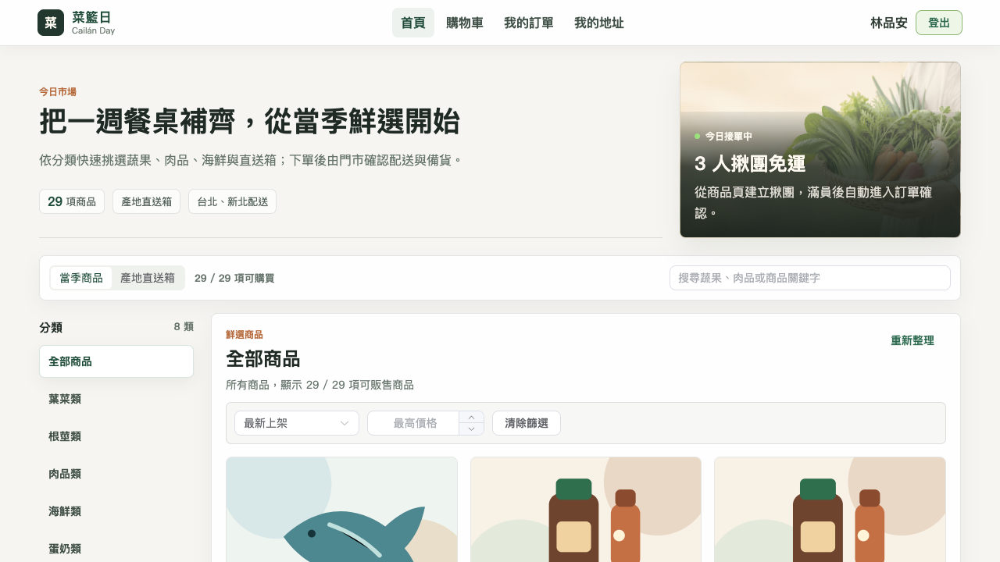
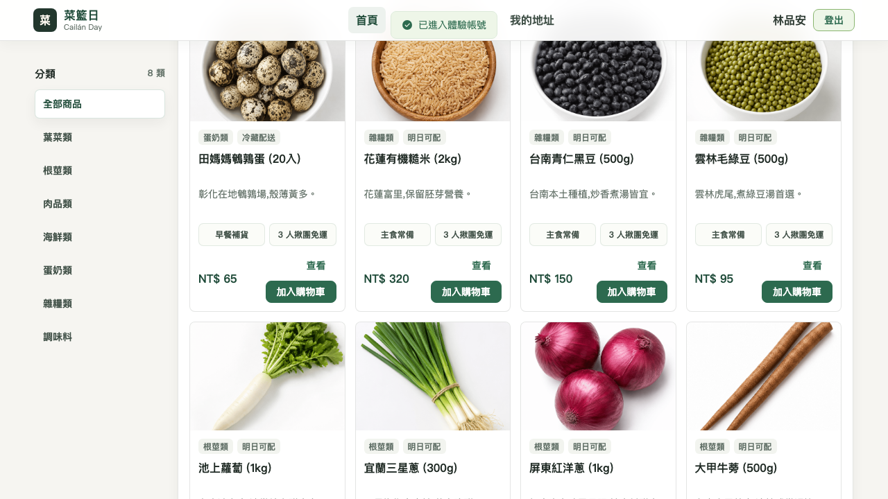
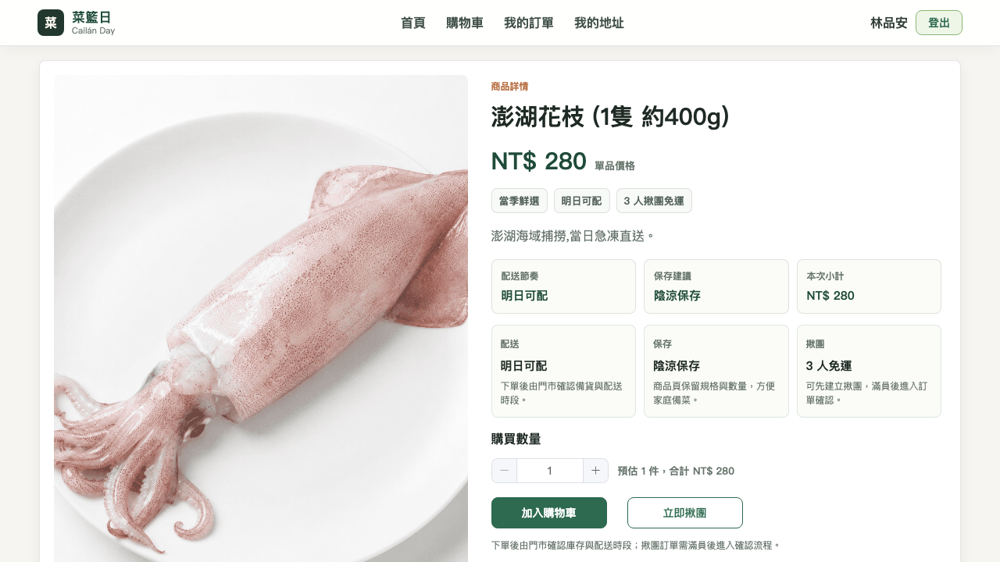
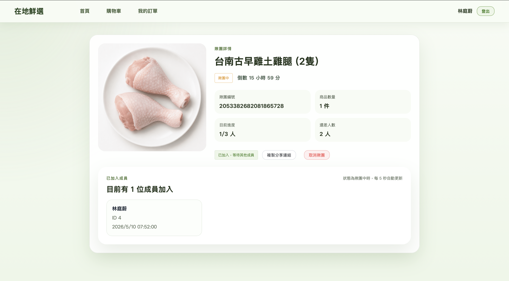
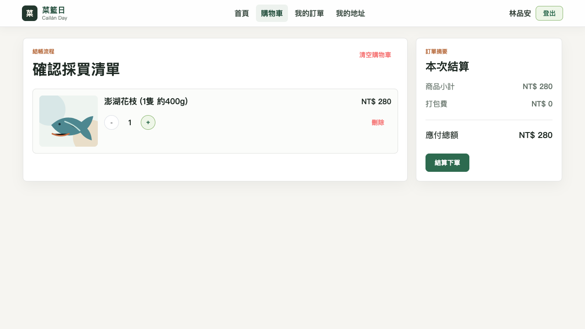
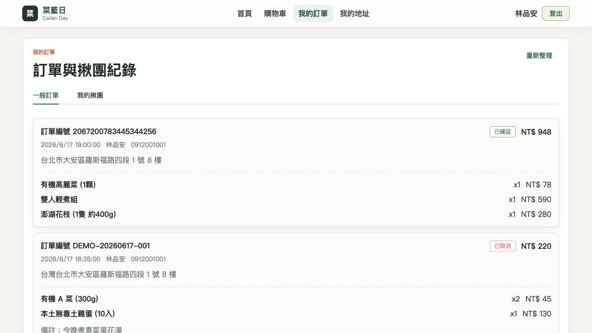
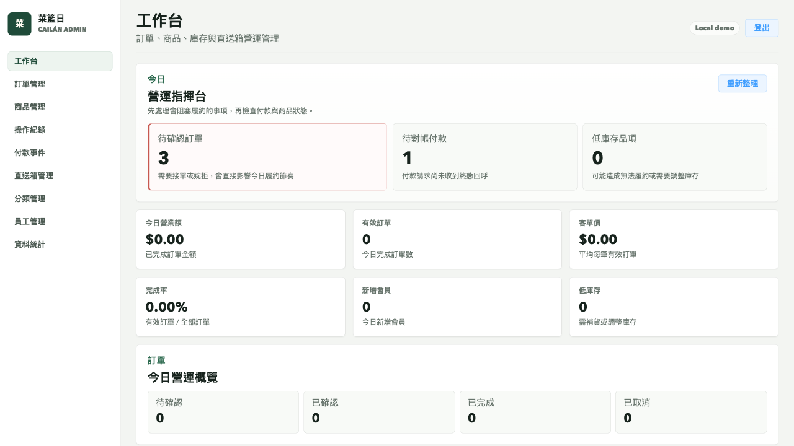
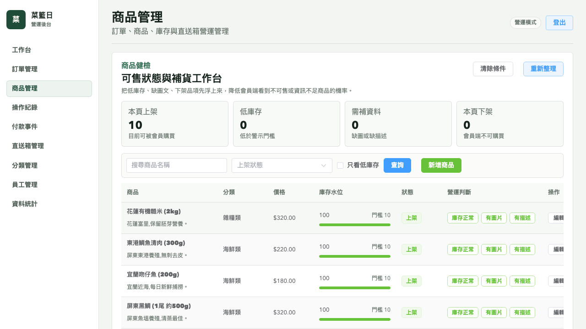
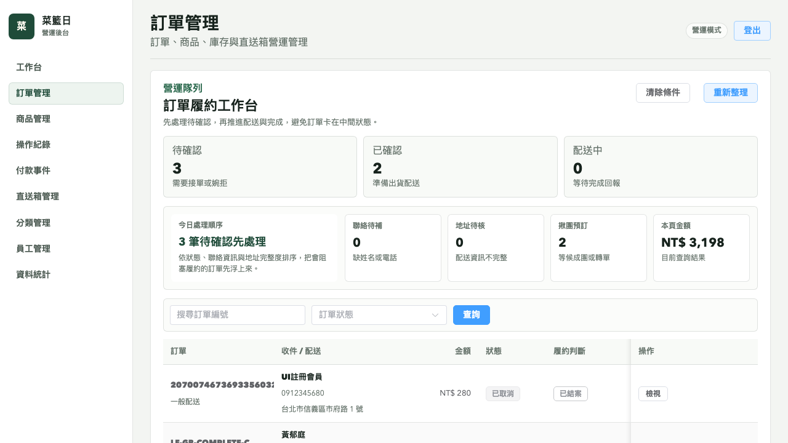
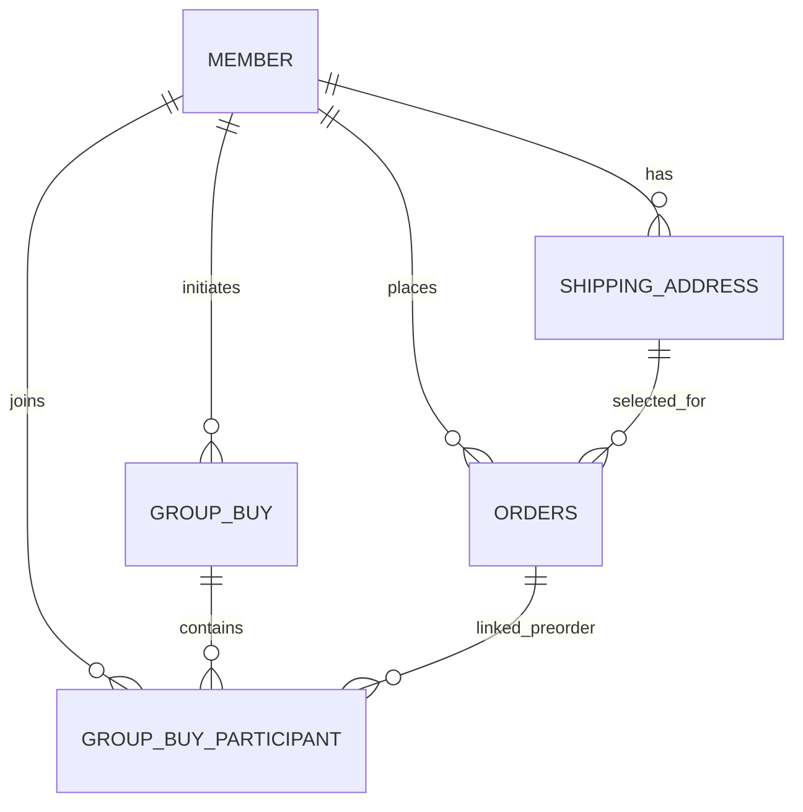

# 菜籃日 Cailán Day

> 結合在地小農生鮮直送與揪團湊免運的 B2C 電商平台


**Demo URL**

用戶端 demo

[https://d3hqnux25iirgl.cloudfront.net](https://d3hqnux25iirgl.cloudfront.net)

> 用戶端 demo 開放使用,可透過開發模式快捷登入快速試玩,或使用 Google 帳號登入體驗完整 OAuth 流程。

管理端 demo

[https://d3czahyk4cnvb9.cloudfront.net](https://d3czahyk4cnvb9.cloudfront.net)

> 管理端已升級為 Vue 3 + Vite + Element Plus 管理後台,負責訂單確認、商品上下架、員工 / 分類 / 直送箱管理與營運數據檢視。

- 如需登入體驗,請聯繫專案作者取得測試帳號(避免公開憑證遭濫用)。
- 後端 API 入口:`https://localfresh-demo.duckdns.org`
- 部署架構:Vue 3 用戶端託管於 AWS S3 + CloudFront(HTTPS),Spring Boot API 部署於 AWS EC2 (Nginx 反向代理 + Let's Encrypt)。

## Demo 流程截圖

實際操作流程，從會員端採買到管理端履約，展示完整的前後台閉環。

### 1. 首頁 — 今日市場與採買入口

首屏以「今日市場」和商品搜尋為主，讓使用者直接進入採買任務，同時保留 3 人揪團免運作為輔助購買動機。



### 2. 商品列表 — 分類、篩選與商品卡

分類側欄、排序、價格篩選與商品卡整合在同一個採買畫面，商品卡顯示分類、配送狀態、描述與台幣定價。



### 3. 商品詳情 — 購物車與揪團雙路徑

可選「加入購物車」累積後一次結算,或「立即揪團」直接發起 3 人成團免運。



### 4. 揪團詳情 — 即時進度與一人取消

倒數計時、成員進度、分享連結與參與者列表集中呈現；發起人在無他人加入時可取消揪團，預訂單同步取消。



### 5. 購物車 — 即時計算總額

確認採買清單、數量調整與訂單摘要分欄呈現，讓結帳前的金額與品項更容易掃描。



### 6. 我的訂單 — 多狀態追蹤

列出各狀態訂單(已完成 / 配送中 / 已確認 / 待付款 / 已取消),含商品明細與取消備註。



### 7. 管理端工作台 — 營運優先順序

管理端提供今日營業額、訂單狀態、低庫存與待處理事項，作為後台營運入口。



### 8. 商品管理 — 上架品質與庫存

商品管理支援搜尋、狀態篩選、低庫存檢視、上架品質檢查、庫存調整與庫存紀錄。



### 9. 訂單管理 — 履約操作

訂單管理支援狀態查詢、詳情檢視、確認、婉拒、取消、配送與完成等履約操作。



## 專案簡介

台灣生鮮電商常見兩個痛點：第一，運費門檻高，少量購買時消費者容易卻步；第二，平台多半只做商品陳列與配送，缺少能提升轉換率與社群擴散的購物機制。菜籃日的設計目標，就是把「在地小農直送」與「揪團湊免運」結合成一個完整的 B2C 訂購流程。消費者可以瀏覽商品與直送箱、加入購物車、建立配送地址並完成下單；若希望降低運費，也可以發起揪團，透過分享連結邀請其他會員加入，達到 3 人成團後即免運。平台後端同時提供商品、訂單、店鋪狀態與營運管理能力，前後端整體圍繞「基本功扎實、流程完整、可實際部署」作為實作目標。

## 技術架構

```text
┌───────────────────────────────┐
│        User Web (Vue 3)       │
│  商品瀏覽 / 購物車 / 揪團 / OAuth │
└──────────────┬────────────────┘
               │ HTTP / JWT
               ▼
┌──────────────────────────────────────────────┐
│         Spring Boot 3.5 Backend API         │
│  Member / Product / Cart / Order / GroupBuy │
│  Google OAuth / JWT / Cache / Scheduler     │
└───────┬──────────────────┬──────────────────┘
        │                  │
        ▼                  ▼
┌───────────────┐   ┌──────────────────┐
│   MySQL 8     │   │   Redis 7        │
│ 訂單 / 商品 /   │   │ 快取 / 店鋪狀態 /  │
│ 揪團 / 會員資料 │   │ 分散式鎖協作       │
└───────────────┘   └─────────┬────────┘
                              │
                              ▼
                     ┌──────────────────┐
                     │   Redisson       │
                     │ Group Buy Lock   │
                     └─────────┬────────┘
                               │
                               ▼
                     ┌──────────────────┐
                     │ 定時任務 / WS 通知 │
                     │ 過期失敗 / 成團通知 │
                     └──────────────────┘

外部服務：
- Google OAuth 2.0：會員登入
- Google Maps API：配送範圍計算
- AWS：EC2（Docker MySQL + Redis）+ S3 + CloudFront + DuckDNS
```

## 揪團核心資料模型

如果面試官只看一段資料設計，我認為最值得看的就是揪團主線。這個專案不是把多人湊團硬塞進單一訂單，而是拆成「揪團活動本身」與「每位參與者自己的預訂單」兩層模型。



- `group_buy`：描述一場揪團活動，負責保存 `group_no / initiator_id / required_count / current_count / status / expire_at`
- `group_buy_participant`：描述「誰參加了哪一團」，並用 `pre_order_id` 連回該會員自己的預訂單
- `orders`：揪團期間先建立 `PENDING_GROUP(8)` 預訂單；成團後批次轉成 `TO_BE_CONFIRMED(2)`，失敗則轉成 `CANCELLED(6)`

這樣設計的好處是：

- 每位參與者都有自己的地址、金額與訂單快照，不需要多人共用同一張訂單
- 成團與失敗只需要做狀態流轉，不必在成團瞬間重建正式訂單
- `group_buy_participant (group_buy_id, member_id)` 的唯一鍵可以和 Redisson lock 一起防止重複加團

完整架構、ER 圖與設計取捨請參考 [docs/architecture.md](docs/architecture.md)。面試展示路線與答辯重點請參考 [docs/interview-guide.md](docs/interview-guide.md)。

### 技術棧

| 區域 | 技術 |
|---|---|
| 後端 | Java 17、Spring Boot 3.5.14、MyBatis、PageHelper、Flyway、JWT、HikariCP、Actuator |
| 前端 | 用戶端 Vue 3 + Vite 5、管理端 Vue 3 + Vite 8、TypeScript、Pinia、Vue Router 4、Element Plus |
| 基礎設施 | MySQL 8、Redis 7、Redisson、Testcontainers、Docker、GitHub Actions |
| 第三方服務 | Google OAuth 2.0、Google Maps API、AWS EC2 + S3 + CloudFront + DuckDNS |

## 核心功能

- 商品與直送箱瀏覽：依分類查看蔬果、肉品、海鮮等商品，以及主題直送箱。
- 購物車與下單流程：支援加入購物車、數量調整、地址選擇、備註填寫與歷史訂單查詢。
- 揪團湊免運：會員可建立揪團、分享連結邀請他人加入，3 人成團後轉為正式訂單。
- 雙軌登入機制：前端支援 Google OAuth 2.0，開發環境保留 mock login 方便測試與 demo。
- 訂單狀態流轉：涵蓋待付款、待確認、已確認、配送中、已完成、已取消，以及揪團中的預訂單狀態；退款以 `pay_status=REFUND` 搭配已取消訂單表示。
- 店鋪與營運管理：管理端可維護商品、分類、訂單與營業狀態。
- 快取與排程協作：以 Redis 快取熱門查詢、以排程處理過期揪團與退款模擬流程。

## 技術亮點

### 1. 揪團模組的併發控制

揪團的關鍵風險在於多人同時加入時，不能超過成團人數，也不能讓同一位會員重複加入。這個專案使用 Redisson 的 `RLock` 對每個 `groupNo` 建立細粒度鎖，採用 `tryLock(3, 5, TimeUnit.SECONDS)`，讓請求在 3 秒內嘗試取得鎖，並把鎖持有時間限制在 5 秒內。實作上將「檢查狀態、建立預訂單、寫入 participant、更新 currentCount、必要時觸發成團」包在同一段交易內，確保資料一致性；而 WebSocket 通知則刻意放在 transaction commit 之後，避免管理端收到通知時資料尚未落庫。

除了 `100-thread` 的 Testcontainers Redis 整合測試外，這組邏輯也補上 JMeter 本地壓測證據：`100` 個併發會員加入同一團時，`POST /user/groupBuy/join` 的 `P95 = 2847.65 ms`、`P99 = 2952.75 ms`、`error rate = 0.00%`，且資料庫最終 `current_count = 101`、`group_buy_participant = 100`，代表沒有出現超賣、重複加入或資料不一致。完整報告請參考 [docs/perf/README.md](docs/perf/README.md)。

### 1.1 壓測摘要

以下是目前主 README 直接保留的關鍵數字，目的是讓 reviewer 不進 `docs/` 也能先看到工程證據：

| 指標 | 結果 |
|---|---|
| 併發情境 | `100` 個會員在 `1` 秒內同時加入同一團 |
| API | `POST /user/groupBuy/join` |
| Throughput | `33.26 req/s` |
| P50 | `1971.0 ms` |
| P95 | `2847.65 ms` |
| P99 | `2952.75 ms` |
| Error rate | `0.00%` |
| DB 驗證 | `current_count = 101`、`participant = 100` |

這裡的 `101` 代表：

- 團主原本已經算 `1` 位 participant
- 本次壓測 `100` 位使用者全部成功加入
- 最終資料庫狀態與 HTTP 層結果一致

### 2. 預訂單與正式訂單分離的揪團建模

揪團期間的訂單並不是一般下單流程，而是先建立 `PENDING_GROUP` 狀態的預訂單。這樣做的好處是可以避免在尚未成團前就扣庫存、清購物車或進行完整配送檢查，讓一般下單與揪團下單的業務邊界保持清楚。成團時，系統再批次把所有 participant 對應訂單轉成 `TO_BE_CONFIRMED`；若過期失敗，則統一轉成 `CANCELLED` 並記錄 mock 退款 log。這種設計讓原有 `order` 模組邏輯大致維持穩定，只在狀態流轉層擴充揪團語意。

### 3. 訂單生命週期規則與 Service 測試證據

訂單狀態轉移集中在 `OrderStatusTransitionPolicy`，明確列出付款、會員取消、管理端確認 / 婉拒 / 取消、配送與完成等操作的合法來源狀態與目標狀態。退款不是額外訂單狀態，而是由取消後的 `pay_status=REFUND` 與 `payment_event` / refund log 表達。這讓 service 層不需要散落判斷規則，也讓「待付款 → 待確認 → 已確認 → 配送中 → 已完成」與取消路徑能被單元測試直接驗證。

目前已補上 `OrderServiceImpl`、`OrderPaymentServiceImpl`、`DemoPaymentGateway`、`EcpayPaymentGateway`、`OrderCancellationServiceImpl`、`OrderFulfillmentServiceImpl` 與 `OrderStatusTransitionPolicy` 的核心測試，涵蓋付款請求與付款成功回呼分離、已取消 / 揪團中訂單不可付款、demo HMAC callback 驗證、ECPay CheckMacValue 驗證與 callback mapping、付款事件紀錄、重複付款 callback、concurrent callback race、已完成訂單不可取消、會員不可操作他人訂單、未付款拒單不退款、直送箱取消時還原組成商品庫存等案例。`local-fresh-server` 已接入 JaCoCo，可用 `mvn -pl local-fresh-server -am verify` 產生 HTML 報告，完整測試策略見 [docs/testing.md](docs/testing.md)。

付款流程另外新增 `payment_event` 事件表，紀錄 `REQUEST_CREATED`、`CALLBACK_SUCCEEDED`、`CALLBACK_DUPLICATE` 與 `CALLBACK_REJECTED`，並提供 `GET /admin/paymentEvents/page` 依訂單編號、provider、事件類型、結果、金流交易編號、冪等鍵與時間範圍查詢。目前 demo gateway 仍維持本機立即付款成功，方便展示；但後端已新增 `/payment/callback` provider 回呼入口、demo HMAC 驗證與可切換的 ECPay CheckMacValue parser，會員端也能把 ECPay 付款請求組成 POST form 導轉。資料模型保留 provider、provider reference、provider trade no、idempotency key、amount、raw payload 與處理結果。後續接綠界 ECPay sandbox 時，主要剩真實 ReturnURL / OrderResultURL callback 驗證與對帳紀錄。

管理端也新增「付款事件」頁，可直接查 demo 訂單的付款請求、成功回呼、重複回呼與拒絕回呼，作為未來金流對帳與客服查單的前台證據。

Actuator 也補上最小業務 metrics，可查付款 callback 結果、訂單取消防重命中與揪團狀態轉換，用來回答「系統跑起來後怎麼看異常」。目前先保留在應用層 counters，不急著導入完整 Prometheus/Grafana stack；查詢方式見 [docs/observability.md](docs/observability.md)。

### 4. 管理端操作 Audit Log

管理端的訂單確認、婉拒、取消、配送、完成，以及商品手動庫存調整，現在會寫入 `admin_operation_log`。這張表記錄 `action`、目標類型與 id、操作前後值、原因、操作者與操作時間，用來回答「誰在什麼時候對哪個業務物件做了什麼變更」。管理端也提供 `GET /admin/operationLogs/page` 分頁查詢，可依 action、target、operator 與時間範圍篩選；後台「操作紀錄」頁可直接查閱這些紀錄，`AdminOperationLogApiTest` 也會從 HTTP 層驗證分頁、篩選與 newest-first 排序。這和 `product_inventory_log` 的庫存流水分工不同：庫存流水專注商品數量變化，Audit Log 則專注後台操作責任與追蹤。

### 5. Testcontainers 驗證 Redis 鎖而非用 mock 帶過

揪團併發控制若只用 `MockBean RedissonClient` 驗證流程，說服力不足，因為真正的風險發生在多執行緒與真實 Redis 鎖行為。這個專案的整合測試採用 Testcontainers 啟動 Redis container，並以 `@DynamicPropertySource` 把 host / port 動態注入測試環境，讓 `GroupBuyRedisIntegrationTest` 真正對 Redisson 做 100-thread 並發驗證。這樣的取捨比 pure mock 更重，但能換來更可信的測試結論；對展示「我知道哪裡該用真實整合測試」這件事，比單純追求測試執行速度更有價值。

### 6. JWT 驗證與 ThreadLocal 請求隔離

前後端 API 使用 JWT 作為會員與管理端身份驗證，並透過攔截器在請求進入時解析 token，將當前使用者資訊放入 ThreadLocal，供後續 service / mapper 取得。這種作法的優點是 controller 不需要反覆傳遞 memberId，邏輯較乾淨；但同時也要求在請求結束時明確清理 ThreadLocal，否則在 servlet thread pool 重用情境下，容易出現跨請求資料污染。專案中已針對這個風險補上回歸測試，確保登入上下文不會殘留到下一個請求。

### 7. Google OAuth 2.0 採授權碼流程而非 Implicit Flow

會員登入採 Google OAuth 2.0 Authorization Code Flow，而不是已逐漸被淘汰的 Implicit Flow。前端只負責導向 Google 授權頁並接收 callback code，真正與 Google token endpoint 溝通、驗證 `id_token`、檢查 `aud / exp` 等工作放在後端進行，降低憑證暴露風險。服務層另外抽出 `GoogleOAuthClient` 作為外部依賴封裝，使測試可以直接 mock `GoogleProfile`，專注驗證 account merge、JWT 簽發與 mock login 開關，而不是把測試耦合到 Google SDK 細節。

### 8. Redisson 與 Spring Data Redis 職責分離

專案中 Redis 有兩種用途：一種是一般 KV / cache，例如商品列表、店鋪營業狀態；另一種是揪團需要的分散式鎖。如果所有 Redis 存取都混用同一套 client，實務上容易出現相容性與責任界線不清的問題。這個專案最後採取的策略是：`RedissonClient` 專責分散式鎖與協調，`RedisTemplate` 則使用 Spring Boot 3 預設的 Lettuce 路徑處理快取與一般資料存取。這個分離避免了 `Tuple` 類別相容性問題，也讓後續維護者更容易理解「哪種場景該用哪種 Redis API」。

### 9. 可部署導向的全流程設計

這個專案雖然是求職作品，但實作方式不是只做出 API 或畫面，而是完整串成「可啟動、可測試、可實際部署」的系統。從 migration 版本化、環境變數管理、dev/test profile 分流、Google OAuth 設定隔離，到前端 Vite proxy 與後端 CORS 協作，都是以實際上線為前提在設計。目前 demo 已部署於 AWS，前端靜態資源、API 服務與 DNS 入口的切分方式，也與實際的 EC2、S3、CloudFront、DuckDNS 架構一致。

## 設計決策 Q&A

### Q1. 為什麼 JWT TTL 設為 2 小時？

2 小時 TTL 是在安全性與 demo / 一般操作體驗之間取的平衡。若時間太短，使用者在瀏覽商品、加入購物車、下單或加入揪團的過程中容易頻繁失效；若時間太長，token 外洩後的風險窗口會變大。這個專案的使用情境不是長時間編輯型系統，而是以購買流程為主，因此 2 小時足夠涵蓋一次完整購買與分享揪團的操作，同時保留合理的風險邊界。

### Q2. 為什麼揪團鎖選 Redisson，不自己用 `SETNX` 實作？

自己用 `SETNX` 實作分散式鎖不是做不到，但要正確處理過期、可重入、釋放鎖時的擁有者判斷與例外情境，代價不低，而且這個專案不是要展示「我能手寫完整鎖框架」。Redisson 已經把這些通用細節處理好，讓程式可以把重點放回業務邏輯：怎麼判斷成團、怎麼做交易邊界、怎麼避免超賣與重複加入。對這個專案來說，選擇成熟元件比重造輪子更合理。

### Q3. 為什麼揪團過期用定時任務，不用 Redis TTL 事件？

Redis key 過期事件看起來很直覺，但在真實系統裡，若採用這條路徑，需啟用 `notify-keyspace-events` 配置，且 Redis 過期事件本身屬非強保證投遞，在資料庫狀態流轉與退款記錄等需要強一致的場景可靠性不足。這個專案用每分鐘掃描一次的定時任務處理過期揪團，雖然不是毫秒級即時，但對「24 小時揪團」這種業務來說完全足夠，而且程式結構更容易理解與測試。這是一個刻意選擇簡單、可維護方案的例子。

### Q4. 為什麼要用 Testcontainers，而不是全都用 mock？

不是所有功能都需要 Testcontainers，但像揪團併發控制這種問題，如果只 mock 掉 Redis 鎖，本質上就跳過了最重要的風險區域。Testcontainers 的價值在於，它讓測試可以在本地與 CI 以接近真實環境的方式啟動 Redis，驗證 Redisson 的實際鎖行為與多執行緒競爭結果。對比 mock，它執行成本較高，但換來的是更強的可信度；這對面試展示來說是值得的。

### Q5. 為什麼管理端也升級到 Vue 3？

管理端是後端作品的重要驗證入口，只做會員端會讓整個系統看起來像單一路徑展示。因此管理端採用 Vue 3 + Vite + TypeScript + Pinia + Element Plus，保留「基本功展示專案」的範圍，不追求複雜 UI，但把登入、列表、表單、訂單操作、營運報表與 API proxy 串接補齊。這樣能讓 reviewer 直接看到後台營運面，而不是只看到前台購物流程。

### Q6. 為什麼 repo 內同時保留 mock login 與 Google OAuth？

開發與 demo 階段若完全依賴 Google OAuth，會讓本地測試高度綁定第三方憑證與人工授權流程，降低開發效率；但如果只做 mock login，又會讓整個登入設計顯得過於簡化。這個專案採雙軌策略：正式流程走 Google OAuth 2.0，開發環境則透過 `mock-login-enabled` 開關保留 mock login，前端也只在 dev 模式顯示快捷登入區塊。這樣既保留真實世界的登入設計，也兼顧開發效率。

## 系統需求

- Java 17+
- Node.js 22+（管理端使用 npm；用戶端可使用 pnpm）
- MySQL 8.x
- Redis 7.x（可使用 Docker 啟動）
- Google OAuth Client（前端與後端需自行申請本地開發憑證）

## 快速開始

### 1. Clone 專案

```bash
git clone https://github.com/kevinlin000/local-fresh-platform.git
cd local-fresh-platform
```

### 2. 準備後端 `application-dev.yml`

請在以下路徑建立本地開發設定：

```text
backend-environment/local-fresh-backend/local-fresh-server/src/main/resources/application-dev.yml
```

至少需要補齊以下設定：

```yaml
localfresh:
  datasource:
    driver-class-name: com.mysql.cj.jdbc.Driver
    host: localhost
    port: 3306
    database: local_fresh
    username: your_db_user
    password: your_db_password

  redis:
    host: localhost
    port: 6379
    database: 0

  jwt:
    admin-secret-key: your-admin-secret
    user-secret-key: your-user-secret

  aws:
    s3:
      region: your-aws-region
      access-key-id: your-access-key
      secret-access-key: your-secret-key
      bucket-name: your-bucket

  google:
    api-key: your-google-maps-api-key

  delivery:
    # 本機 demo 預設不依賴 Google Maps；正式環境可改為 true。
    range-check-enabled: false

  oauth:
    google:
      client-id: your-google-oauth-client-id
      client-secret: your-google-oauth-client-secret
      redirect-uri: http://127.0.0.1:5173/oauth/callback

  auth:
    mock-login-enabled: true

  shop:
    address: 台北市信義區市府路1號

springfox:
  documentation:
    enabled: false

knife4j:
  enable: false
```

若僅需本地開發、功能驗證或壓測，可先使用 `mock-login-enabled: true` 的開發模式，不必先完成 Google OAuth 憑證申請；Google OAuth 主要用於展示正式登入流程。

### 3. 啟動本地 MySQL / Redis

```bash
cd backend-environment/local-fresh-backend
cp .env.example .env
docker compose up -d
```

後端已接入 Flyway，啟動時會自動執行 `local-fresh-server/src/main/resources/db/migration/` 內的版本化 migration。全新資料庫可直接啟動；若使用的是舊有非空 schema 且尚未有 `flyway_schema_history`，第一次啟動請加上 `FLYWAY_BASELINE_ON_MIGRATE=true` 完成 baseline，之後再關閉此設定。

本地 MySQL 容器只負責提供空資料庫，schema 與 seed data 都由 Spring Boot 啟動時的 Flyway 統一管理。`V10__demo_journey_seed.sql` 會建立作品展示用資料：試用會員 `user_a / user_b / user_c`、配送地址、購物車、一般訂單與揪團案例。這三個 code 對應用戶端登入頁的「試用會員 A/B/C」，可直接走完商品瀏覽、購物車、下單、訂單狀態與揪團頁面。

若本機 `3306` 已被 MySQL 佔用，可只啟動 Redis，並讓後端連到既有 MySQL：

```bash
docker compose up -d redis
```

### 4. 啟動後端

```bash
cd backend-environment/local-fresh-backend
mvn install -DskipTests
mvn -pl local-fresh-server spring-boot:run
```

第一行會先把 `local-fresh-common` 與 `local-fresh-model` 更新到本機 Maven repository，避免 server 啟動時跑到舊的 shared module artifact。

舊資料庫第一次導入 Flyway 時：

```bash
mvn install -DskipTests
FLYWAY_BASELINE_ON_MIGRATE=true mvn -pl local-fresh-server spring-boot:run
```

### 5. 啟動管理端

```bash
cd frontend-environment/local-fresh-admin
npm ci
npm run dev -- --host 127.0.0.1
```

管理端預設啟動於 `http://127.0.0.1:5174`，Vite proxy 會將 `/api` 轉到 `http://localhost:8080/admin`。

### 6. 準備用戶端 `.env.local`

請建立：

```text
frontend-environment/local-fresh-user/.env.local
```

內容範例：

```env
VITE_GOOGLE_CLIENT_ID=your-google-client-id.apps.googleusercontent.com
```

### 7. 啟動用戶端

```bash
cd frontend-environment/local-fresh-user
pnpm install
pnpm dev
```

### 8. Google OAuth Client 申請步驟

完整的前端 OAuth 設定說明請參考：

- [frontend-environment/local-fresh-user/README.md](frontend-environment/local-fresh-user/README.md)

## 部署

目前上線中的部署架構如下：

- **EC2**：部署 Spring Boot API
- **Nginx + Let's Encrypt**：在 EC2 上提供 HTTPS 反向代理，將公開 API 網域轉到 Spring Boot `8080`
- **EC2 內 Docker MySQL + Redis**：儲存商品、會員、訂單、揪團資料與快取 / 鎖協作
- **S3**：承載前端靜態檔案
- **CloudFront**：對外提供 CDN 與 HTTPS 存取
- **DuckDNS**：提供後端 API 對外網域入口

> 詳細架構與時序圖請參考 `docs/architecture.md`。

## 已知限制

- 本機支付流程仍可使用 demo gateway；EC2 demo 已可透過 SSM 切到 ECPay sandbox provider，且已用 Playwright 驗證會員端可導向綠界 ECPay stage checkout；尚未完成的是 sandbox 卡號付款成功、ReturnURL / OrderResultURL 回流與 reconciliation
- 管理端已完成核心營運台與表格頁 polish，但尚未加入完整 E2E 視覺回歸
- 用戶端已完成桌面與手機版 RWD 基礎體驗，尚未加入跨瀏覽器視覺回歸測試
- 舊資料庫第一次導入 Flyway 時需要 baseline；全新資料庫可直接套用 migration

更多細節請參考：
- [docs/known-issues.md](docs/known-issues.md)

## 相關文件

- [docs/known-issues.md](docs/known-issues.md)
- [docs/architecture.md](docs/architecture.md)
- [docs/backend-deploy-runbook.md](docs/backend-deploy-runbook.md)
- [docs/ecpay-sandbox-runbook.md](docs/ecpay-sandbox-runbook.md)
- [docs/interview-guide.md](docs/interview-guide.md)
- [docs/observability.md](docs/observability.md)
- [docs/portfolio-roadmap.md](docs/portfolio-roadmap.md)
- [docs/testing.md](docs/testing.md)
- [frontend-environment/local-fresh-user/README.md](frontend-environment/local-fresh-user/README.md)

ECPay sandbox 檢查與 EC2 provider 切換可執行：

```bash
scripts/package-backend-release.sh
EXPECTED_DEPLOY_COMMIT=<deployed-commit> \
scripts/check-ecpay-sandbox-readiness.sh
EXPECTED_DEPLOY_COMMIT=<deployed-commit> \
scripts/switch-ecpay-sandbox-ssm.sh enable
scripts/switch-ecpay-sandbox-ssm.sh status
```

本機 demo 或截圖前可先執行：

```bash
scripts/check-ui-smoke-local.mjs
```

若要跑真瀏覽器 smoke，先啟動 backend、會員端與管理端，再執行：

```bash
npm install
npx playwright install chromium
USER_BASE_URL=http://127.0.0.1:5176 \
ADMIN_BASE_URL=http://127.0.0.1:5177 \
npm run smoke:browser
```

## Roadmap

本專案目前已完成核心業務閉環,接下來規劃的迭代方向圍繞「展示工程深度」與「貼近真實生產系統」兩個目標進行。完整評估矩陣請參考 [docs/portfolio-roadmap.md](docs/portfolio-roadmap.md)。

### 進行中

- **ECPay sandbox checkout 證據**: EC2 backend 已同步到 commit `5612e4c24601`，public `/actuator/info` 與 `/payment/callback` preflight 已通過，runtime 維持 `PAYMENT_PROVIDER=ecpay`。Playwright 已從 CloudFront 會員端建立待付款訂單並導向綠界 stage checkout，截圖保存在 `docs/screenshots/10-ecpay-stage-checkout.png`；下一步是完成 sandbox 卡號付款，確認 ReturnURL / OrderResultURL 與 `payment_event` 的 `CALLBACK_SUCCEEDED` 落點。
- **Browser UI smoke**:在 dependency-free local precheck 之外，新增 Playwright Chromium smoke，覆蓋會員登入/home/orders 與管理端登入/dashboard/orders/products。

### 規劃中

- **綠界 ECPay reconciliation**:在 EC2 sandbox provider 已可切換後,補真實 ReturnURL / OrderResultURL 成功付款證據、重複 callback replay、付款事件對帳與 reconciliation job。
- **可觀測性三件套**:Spring Boot Actuator + Prometheus + Grafana,自訂業務 metric(揪團成團率、支付成功率),搭配結構化 log 與 Trace ID 串穿全鏈路。
- **CD 自動化**:在現有 GitHub Actions 測試/build 基礎上,加入 Docker image build、推送 ECR,並觸發 EC2 滾動部署。

### 已完成里程碑

- 揪團分散式鎖壓測證據:100 concurrent join JMeter 壓測,`joinGroupBuy` error rate `0.00%`, P95 `2847.65 ms`, DB 最終 `current_count=101 / participant=100`
- 訂單生命週期測試證據:`OrderStatusTransitionPolicy` 集中管理狀態轉移,核心 Order service 測試涵蓋付款、取消、婉拒、配送、完成與還庫存,並可用 JaCoCo 產生本地覆蓋率報告
- 最小業務可觀測性:Actuator metrics 暴露付款 callback、訂單取消防重與揪團狀態轉換 counters,並保留環境變數覆蓋 exposure 範圍
- 本機 UI smoke precheck:不新增測試框架,以 Node script 檢查 backend health、前端 dev server、會員/管理端登入與核心資料 API
- 真瀏覽器 UI smoke:以 Playwright Chromium 檢查會員端與管理端關鍵頁面可登入、可載入、可互動
- 庫存異動防重:取消訂單時若已取消或已有 `ORDER_CANCEL_RESTORE` 庫存回補紀錄,service 會跳過重複退款、訂單更新與庫存回補；庫存流水另有 nullable `idempotency_key` unique constraint 作為 DB 最後防線
- 管理端操作 Audit Log:訂單確認、婉拒、取消、配送、完成與商品手動庫存調整會寫入 `admin_operation_log`,並提供分頁查詢 API 與後台「操作紀錄」頁,保留操作前後值、原因與操作者
- EC2 ECPay sandbox runtime switch:透過 SSM 寫入獨立 systemd payment drop-in，已驗證 public readiness、`PAYMENT_PROVIDER=ecpay` effective env、health 與 rollback 腳本入口
- 雙端產品級 UI polish:會員端採買流程、商品詳情、購物車、訂單頁與管理端 dashboard / products / orders 已完成新版截圖與 README 同步
- 揪團發起 / 加入 / 取消 / 過期失敗回滾完整流程
- Google OAuth 2.0 Authorization Code Flow + JWT 雙軌登入(mock login dev 開關)
- 完整 AWS 部署:EC2 (Nginx + Spring Boot + Docker MySQL/Redis) + S3 + CloudFront + DuckDNS + Let's Encrypt
- Spring Boot 3.5 升級 + Flyway migration 檔案版本化(V1~V11)
- 管理端 Vue 3 + Vite + TypeScript + Pinia + Element Plus 升級
- Testcontainers Redis 整合測試 + GitHub Actions backend/admin/user frontend checks
- CI quality gate：GitHub Actions 會跑 repository hygiene、後端 `verify` + JaCoCo artifact、backend release package artifact + SHA256 verifier、管理端 build / audit、會員端 build

## License

This project is licensed under the MIT License. You may use, modify, and distribute this project with proper attribution. See the repository license section or future `LICENSE` file updates for details.
