# 系統設計文件

## 文件目的

本文件作為專案根 README 的延伸說明，聚焦於系統內部設計、資料模型、關鍵流程與技術取捨。
若 README 提供的是產品與功能總覽，這份文件則用來說明系統如何被拆解、如何運作，以及為什麼採用目前的實作方式。

---

## 系統架構

### 架構概觀

整體系統由用戶端網站、管理端網站、Spring Boot 後端 API、MySQL、Redis 與第三方服務組成。
用戶端負責瀏覽商品、購物車、下單與揪團；管理端負責商品、分類、訂單與店鋪營運管理；後端負責身份驗證、業務邏輯、資料存取與整合外部服務。

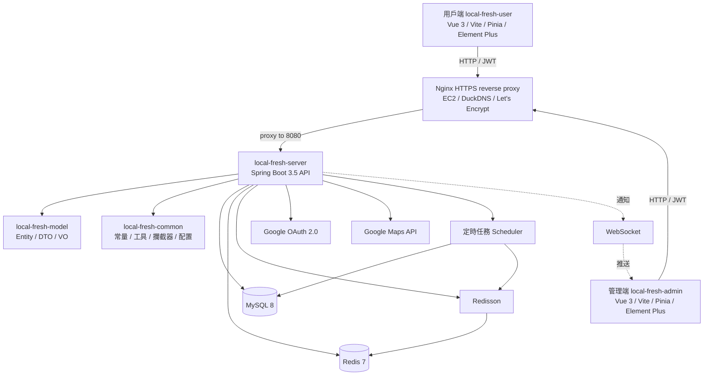

### 模組劃分

#### 1. 用戶端 `local-fresh-user`

用戶端是支援桌面與手機版的生鮮電商網站，負責：

- 會員登入（Google OAuth 與開發模式 mock login）
- 單品與直送箱瀏覽
- 購物車與下單流程
- 揪團發起、分享、加入與狀態追蹤

前端採用 Vue 3、Vite、Pinia 與 Element Plus，透過 `/api` proxy 串接後端，並以 JWT 維持會員登入狀態。

#### 2. 管理端 `local-fresh-admin`

管理端採用 Vue 3、Vite、Pinia、TypeScript 與 Element Plus，主要負責：

- 單品與直送箱管理
- 商品分類維護
- 訂單查詢與處理
- 店鋪營業狀態切換
- 基本營運統計與報表頁面

目前管理端以「可展示營運基本功」為範圍，涵蓋登入、列表、表單、訂單操作與營運報表，避免把作品停留在只展示會員端的狀態。

#### 3. `local-fresh-server`

`local-fresh-server` 是主要業務模組，包含：

- Controller：對外 API 入口
- Service：業務流程與交易邊界
- Mapper：MyBatis 資料存取
- Config：WebMVC、Redis、Swagger、CORS 等設定
- Task：定時任務
- WebSocket：成團通知等即時事件

此模組負責整合 MySQL、Redis、Redisson、Google OAuth 與 Google Maps。

#### 4. `local-fresh-model`

`local-fresh-model` 負責承載資料結構：

- Entity：對應資料表
- DTO：前端入參
- VO：回傳前端的視圖模型

將資料模型獨立出來的好處是讓 controller / service / mapper 可以共用同一組型別，降低模組間重複。

#### 5. `local-fresh-common`

`local-fresh-common` 提供橫向共用能力：

- 常量定義
- 工具類（JWT、Snowflake、地圖、第三方整合）
- 統一例外
- 攔截器與 ThreadLocal 上下文
- 通用配置物件

這個模組的角色是把「不屬於單一業務模組」的橫切關注點集中管理。

### 模組間互動關係

系統請求大致遵循以下路徑：

1. 前端透過 JWT 或 OAuth 流程向後端送出請求。
2. 後端攔截器驗證身份，將登入上下文放入 ThreadLocal。
3. Controller 接收 DTO，交由 Service 處理業務邏輯。
4. Service 視需求存取 MySQL、Redis、Redisson 或外部服務。
5. 回傳結果以 VO 包裝，提供前端頁面顯示或狀態更新。

---

## 資料模型

### 核心資料表概念

系統的資料模型可分為五大區塊：

1. **會員與員工**
   - `member`
   - `employee`

2. **商品與分類**
   - `category`
   - `product`
   - `product_spec`
   - `gift_box`
   - `gift_box_product`

3. **購物與地址**
   - `cart`
   - `shipping_address`

4. **訂單**
   - `orders`
   - `order_detail`
   - `payment_event`
   - `product_inventory_log`
   - `admin_operation_log`

5. **揪團**
   - `group_buy`
   - `group_buy_participant`

### 核心交易 ER Diagram

以下 ER 圖以系統核心資料表為主，標出主要關聯、外鍵方向與關鍵 unique key。
付款事件、庫存異動與管理操作留痕屬於 append-style evidence table；部分 `reference_id` / `operator_id` 是邏輯關聯，不一定是資料庫層級外鍵。

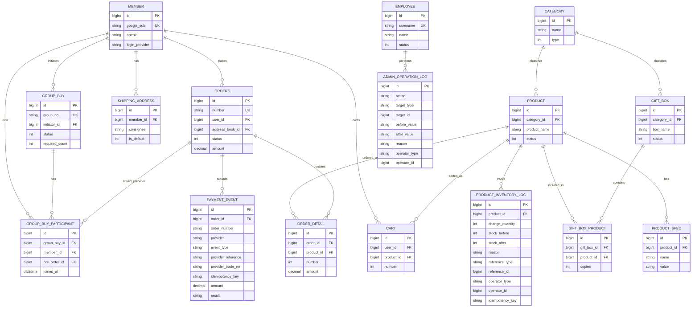

### 資料模型閱讀順序

完整 ER 圖適合做總覽；若要快速理解核心交易流程，建議按以下順序閱讀：

1. 先看 README 的 demo 截圖與揪團核心資料模型，理解使用者流程。
2. 再看本節完整 ER 圖，確認核心資料表與關聯方向。
3. 接著看訂單狀態機，確認狀態轉移不是散落在各 controller。
4. 最後看付款 callback sequence，確認 idempotency 與 payment evidence。

這樣可以避免一開始陷入欄位細節，也能把閱讀重點放在 correctness、交易邊界與可追溯性。

### 揪團核心資料模型

如果只看揪團這條主線，實際上最重要的是以下 5 張表：

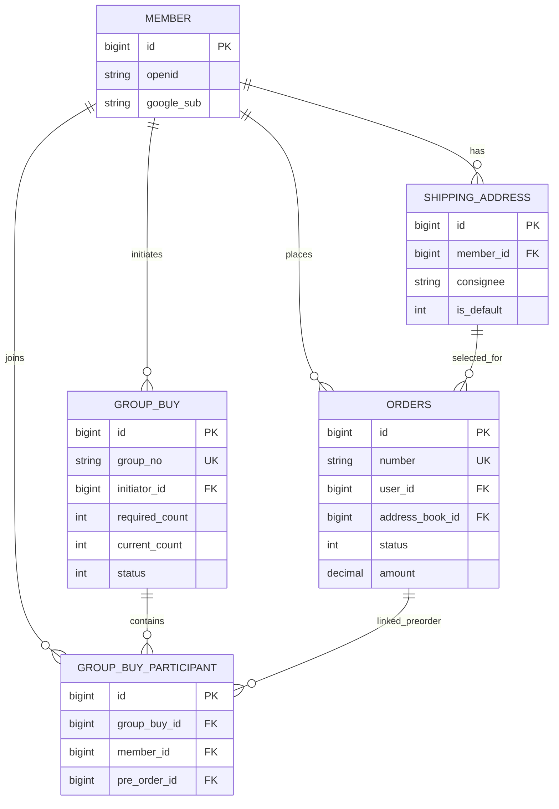

### 為什麼揪團不直接掛在一般訂單上

這個專案的揪團不是「多人一起改同一張訂單」，而是：

1. 每位參與者各自建立一張 `PENDING_GROUP` 預訂單
2. 用 `group_buy` 描述這次團購活動本身
3. 用 `group_buy_participant` 連接「誰參加了哪一團」以及「他對應的預訂單是哪一筆」

這樣做有三個直接好處：

- **避免多人共用同一筆訂單資料**
  每位會員的地址、金額、下單時間都可以保留在自己的預訂單上，不需要在同一筆訂單裡塞多位收件資訊。

- **成團與失敗只需要做狀態流轉**
  成團時把所有 participant 的預訂單由 `PENDING_GROUP(8)` 批次改成 `TO_BE_CONFIRMED(2)`；失敗時統一改成 `CANCELLED(6)`，不需要重建正式訂單。

- **資料追溯清楚**
  面對「這個會員有沒有加入過這團」「這團對應到哪些預訂單」「哪筆預訂單屬於哪一團」這類查詢時，關聯會比把所有資訊混在 `orders` 裡清楚得多。

### 為什麼 `group_buy` 不直接存 `product_id`

這個決策很容易被問到，也是這份文件最值得保留的一點。

目前 `group_buy` 只存：

- 揪團編號 `group_no`
- 發起人 `initiator_id`
- 成團門檻 `required_count`
- 當前人數 `current_count`
- 狀態與到期時間

商品資訊則是透過「發起人的 `pre_order -> order_detail`」反推。這樣做的理由是：

- **避免雙寫**
  如果 `group_buy` 自己也存一份 `product_id / quantity`，就會與發起人的預訂單資料重複，未來一旦修改規格或數量，兩邊可能不一致。

- **維持揪團本體只描述活動，不描述交易細節**
  `group_buy` 負責回答「這是一個怎樣的團」，`orders / order_detail` 負責回答「實際買了什麼」。

- **目前業務模型只支援單商品揪團**
  發起人建團時本來就會同時建立一筆預訂單，因此用預訂單當商品事實來源，邏輯上已足夠。

### 關鍵約束說明

- `member.google_sub`：Google OAuth 使用者唯一識別
- `group_buy.group_no`：揪團分享與查詢的唯一對外編號
- `orders.number`：訂單編號，使用 Snowflake 產生
- `group_buy_participant (group_buy_id, member_id)`：
  同一位會員不可重複加入同一個揪團
- `cart`：
  同一會員、同一商品與規格，邏輯上應聚合成同一筆 cart item
- `order_detail`：
  作為訂單快照，保留當下的名稱、圖片、價格等資訊

### 索引與查詢熱點

目前與揪團最相關的索引有：

- `group_buy.uk_group_no`
  對外查詢、分享連結、加團流程都以 `group_no` 為入口。

- `group_buy.idx_status_expire(status, expire_at)`
  給定時任務掃描「仍在揪團中且已過期」的資料使用。

- `group_buy.idx_initiator(initiator_id)`
  給會員查詢自己發起的揪團使用。

- `group_buy_participant.uk_group_member(group_buy_id, member_id)`
  這是防止重複加團的關鍵 constraint，與 Redisson lock 共同形成雙保險。

- `group_buy_participant.idx_group(group_buy_id)`
  用於查詢某團 participant 清單與成團後批次更新預訂單。

與付款、庫存、營運留痕相關的索引有：

- `payment_event.idx_payment_event_order_time(order_number, created_at)`
  依訂單追查付款請求、成功 callback、重複 callback 或 rejected callback。

- `payment_event.idx_payment_event_trade_no(provider, provider_trade_no)`
  保留未來依金流交易編號做 reconciliation 的入口。

- `payment_event.idx_payment_event_idempotency_key(idempotency_key)`
  目前是查詢與診斷用索引，尚未升級成 unique constraint。

- `product_inventory_log.idx_inventory_log_reference(reference_type, reference_id)`
  讓取消訂單或其他業務 reference 可以快速查是否已經還庫存。

- `product_inventory_log.uk_inventory_log_idempotency_key(idempotency_key)`
  只對有冪等鍵的庫存事件生效；目前用於取消還庫存，作為 service precheck 之外的 DB 最後防線。

- `admin_operation_log.idx_admin_operation_target_time(target_type, target_id, created_at)`
  用於管理端追查某筆訂單或商品的操作歷程。

### 付款、庫存與管理留痕模型

付款、取消、庫存異動與管理操作都需要可追溯證據。下圖的重點不是新增大量資料表，而是讓高風險操作都能被查回來源事件與操作者。

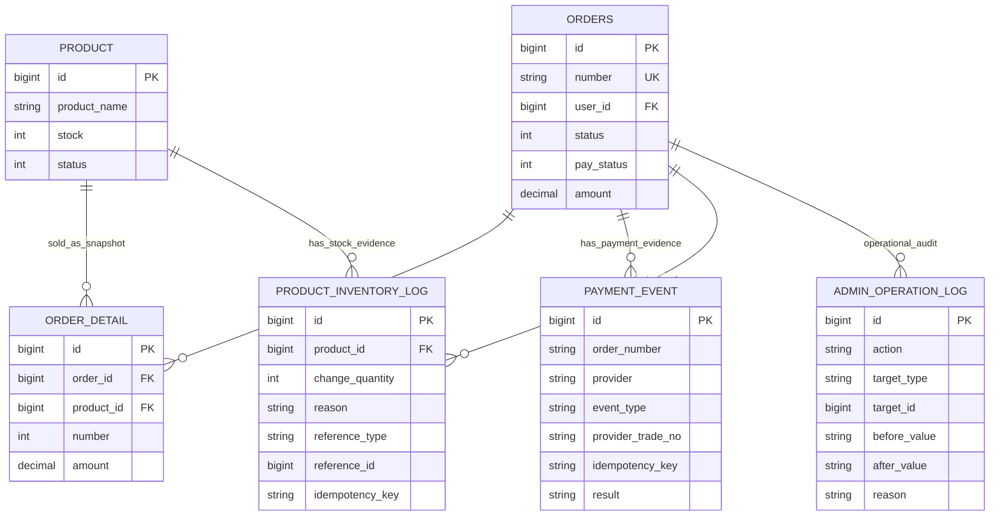

實作上目前仍是單體 service-level consistency，但取消還庫存已補上 DB-level 冪等鍵：

- 付款成功透過 guarded update 推進訂單狀態，所有 callback 分支都寫入 `payment_event`。
- 取消訂單會先檢查訂單狀態與 `ORDER_CANCEL_RESTORE` 庫存紀錄，並以 `product_inventory_log.idempotency_key` unique constraint 作為重複還庫存的最後防線。
- 管理端履約與商品庫存調整寫入 `admin_operation_log`，支援後台查詢「誰在什麼時候改了什麼」。

---

## 關鍵業務流程

### 4.1 會員登入流程（Google OAuth + mock 雙軌）

系統保留兩條登入路徑：

- 正式路徑：Google OAuth 2.0 Authorization Code Flow
- 開發路徑：mock login

兩者都會在後端完成會員查找 / 建立與 JWT 簽發，最後回傳同一個 `MemberLoginVO`。

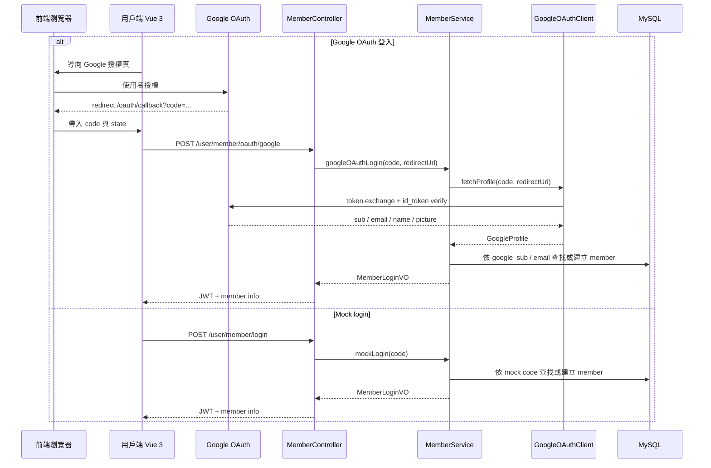

### 4.2 一般下單流程

一般下單採購物車模式，先把商品聚合到 cart，再以選定地址提交訂單。

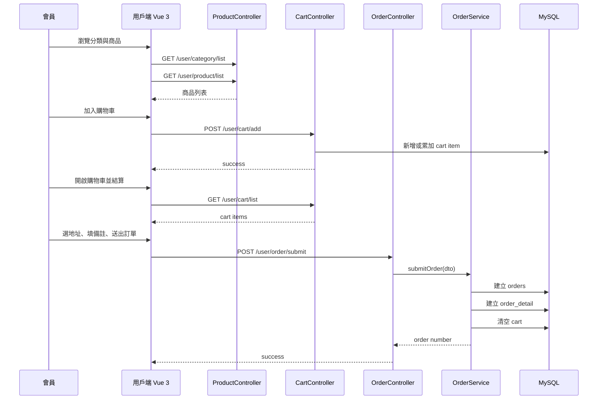

### 4.3 揪團發起流程

揪團發起不是一般下單，而是先建立一筆 `PENDING_GROUP` 狀態的預訂單，並建立 `group_buy` 主檔與發起者 participant。

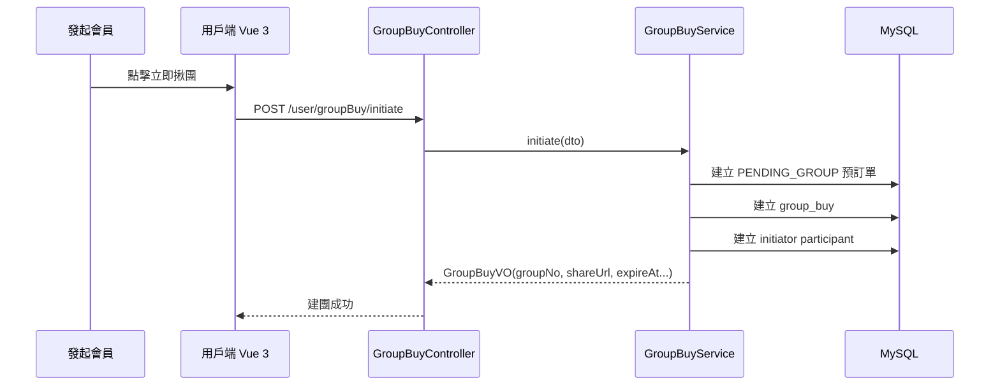

### 4.4 揪團加入與自動成團流程

加入揪團的重點在於：

- 對 `groupNo` 取得 Redisson lock
- 在交易內檢查狀態與人數
- 建立 participant 預訂單
- 最後一位加入時，自動觸發成團

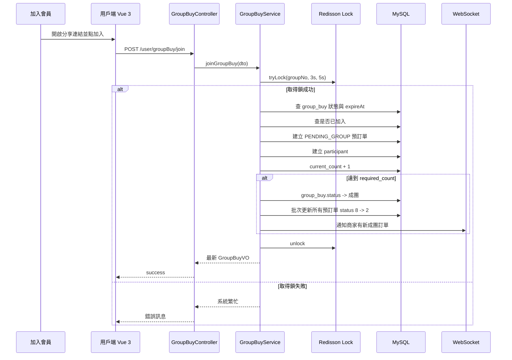

### 4.5 揪團過期失敗流程

若揪團未在時效內湊滿人數，系統透過定時任務掃描失敗案件，並在鎖保護下批次取消預訂單。

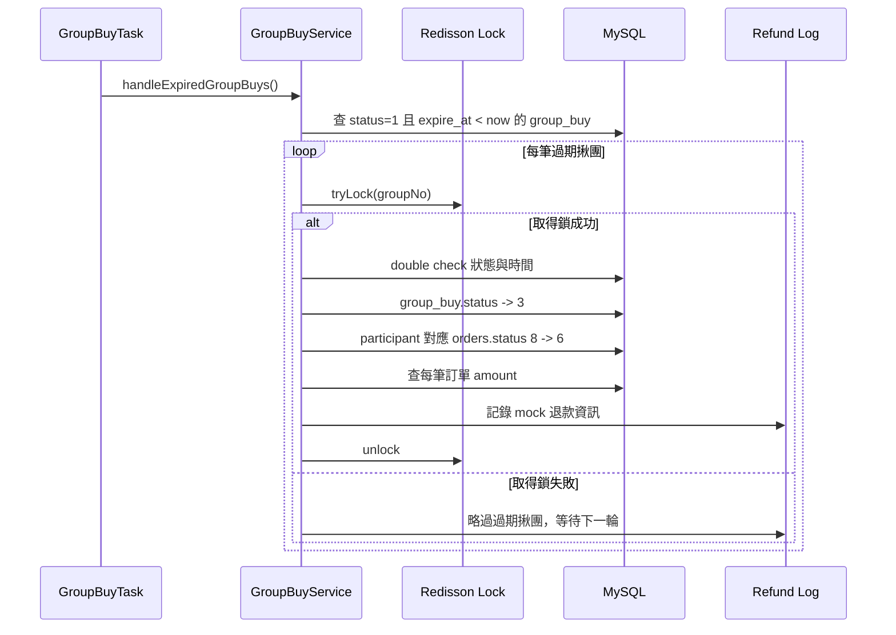

### 4.6 付款 callback 與事件紀錄流程

付款流程刻意不把「前端看到成功」當成最終事實，而是以 provider callback 推進訂單付款狀態。
所有結果都會寫入 `payment_event`，讓成功、重複、拒絕或錯誤 callback 都能追溯。

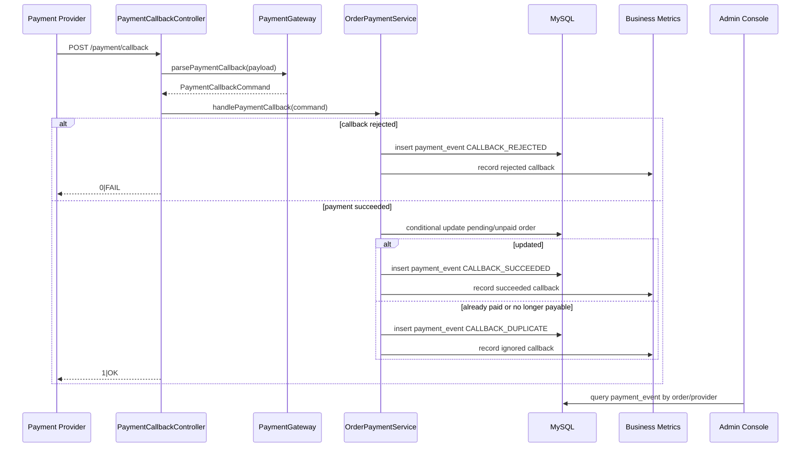

目前這條路徑已具備 demo provider HMAC、ECPay CheckMacValue parsing / verification 測試、公開 EC2 callback preflight、Playwright ECPay sandbox OTP 成功回流證據、待對帳候選查詢、provider-query reconciliation job、pending candidate gauge 與 Grafana dashboard JSON；尚未完成的是 live Grafana/Alertmanager 接線與外部查詢排程的長時間運行證據。

---

## 核心狀態機

### 5.1 訂單狀態機

訂單狀態延續一般電商流程，並額外加入揪團期間的 `PENDING_GROUP = 8`。
退款不是獨立的訂單狀態，而是透過 `pay_status = REFUND` 搭配 `status = CANCELLED` 表達；這讓訂單生命週期保持單一狀態軸，付款/退款痕跡則留在支付狀態與 `payment_event`。

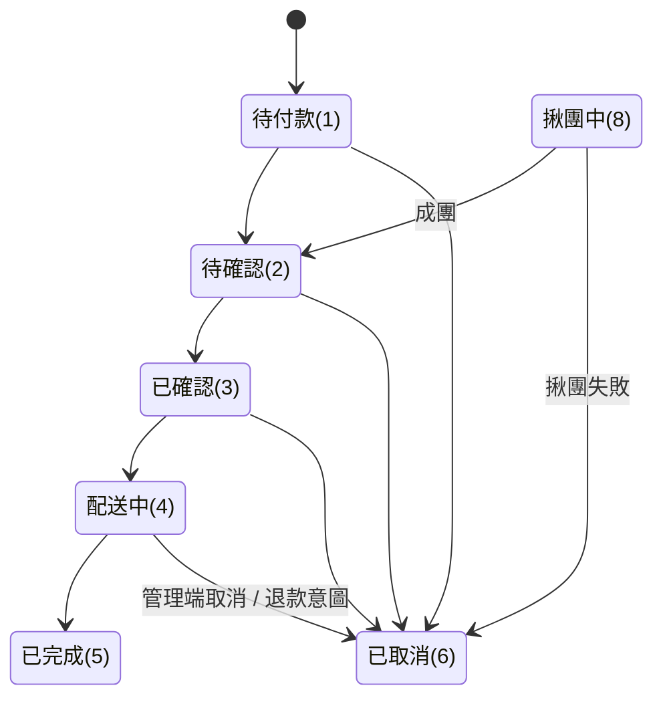

`OrderStatusTransitionPolicy` 對應的合法轉移如下：

| 操作 | 合法來源狀態 | 目標狀態 |
|---|---|---|
| 付款成功 | 待付款 | 待確認 |
| 會員取消 | 待付款、待確認 | 已取消 |
| 管理端確認 | 待確認 | 已確認 |
| 管理端婉拒 | 待確認 | 已取消 |
| 管理端取消 | 待付款、待確認、已確認、配送中 | 已取消 |
| 開始配送 | 已確認 | 配送中 |
| 完成配送 | 配送中 | 已完成 |

付款成功的實際更新使用 `markPaymentSucceededByNumber`，SQL 會同時比對來源 `status` 與 `pay_status`，避免重複 callback 或非法狀態把訂單推進到下一階段。

### 5.2 揪團狀態機

揪團主檔本身也有自己的生命週期，用來描述活動狀態。

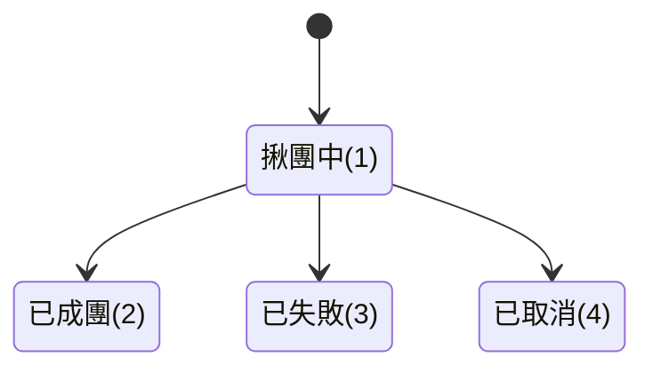

---

## 技術選型對照

下表整理本專案中幾個關鍵技術選型，以及「為什麼選 X，而不是 Y」。

| 題目 | 採用方案 | 替代方案 | 取捨說明 |
|---|---|---|---|
| 分散式鎖 | Redisson | 自己用 `SETNX` 手寫鎖 | Redisson 已處理可重入、過期與釋放鎖細節，能讓程式聚焦在揪團業務本身。 |
| Redis client | Lettuce + Redisson 分工 | 全部走 Jedis / 全部走 Redisson | 一般 cache 與分散式鎖分開管理，責任更清楚，也避開相容性問題。 |
| Redis 鎖測試 | Testcontainers | embedded redis / pure mock | Testcontainers 可驗證真實鎖行為，對 100-thread 併發測試可信度最高。 |
| OAuth 流程 | Authorization Code Flow | Implicit Flow | 授權碼流程把 token 交換與驗證放到後端，安全性較高，也更符合現代 OAuth 慣例。 |
| 揪團過期處理 | 每分鐘排程掃描 | Redis keyspace events | 排程較容易測試與維護；Redis 過期事件需額外配置，且投遞語意較弱。 |
| 交易邊界實作 | `TransactionTemplate` + 受控鎖區塊 | 全部直接 `@Transactional` 包外層 | 揪團 join 流程需把鎖與交易邊界明確區分，避免通知與交易提交時序混亂。 |
| ORM 框架 | MyBatis | JPA / Hibernate | 訂單統計、報表、揪團批次更新等場景需要對 SQL 有直接控制，MyBatis 的 XML mapper 表達原生 SQL 更清楚；JPA 在這類場景容易回到 native query 或 specification，反而增加複雜度。 |
| 用戶端前端 | Vue 3 + Vite | 沿用早期前端棧 | 用戶端是主要展示面，使用較新的前端工程組合較合理。 |
| 管理端前端 | Vue 3 + Vite + TypeScript | 保留早期腳手架 | 管理端是後端作品的重要驗證入口，升級後能展示 API 串接、表單驗證、營運操作與報表資料，而不是只留下不可展示的舊管理介面。 |

### 為什麼揪團模組偏向 `TransactionTemplate`

在一般 CRUD 場景中，`@Transactional` 已足夠；但揪團加入流程同時涉及：

- Redisson 鎖
- 預訂單建立
- participant 寫入
- 成團條件判斷
- 提交通知時序

如果把所有事情都塞在一個 `@Transactional` 公開方法內，很容易讓鎖範圍、資料庫交易範圍與通知時機混在一起。
本專案因此採取「先取得鎖，再用 `TransactionTemplate` 包住核心交易邏輯，最後在 commit 後發送通知」的做法，讓責任邊界更清楚。

---

## 測試策略

### 測試分層

測試策略分成三層：

1. **回歸測試**
   - 驗證先前修復過的問題不再復發
2. **流程驗證**
   - 驗證主要 API 流程、登入流程、購物車流程、揪團流程
3. **真實整合測試**
   - 驗證 Redis 分散式鎖與多執行緒併發

### 主要測試類別與覆蓋範圍

| 測試類別 | 覆蓋範圍 |
|---|---|
| `IssueS2IdorOrderTest` | 訂單越權存取（IDOR）防護 |
| `IssueS3SalesTop10Test` | 報表與統計查詢邏輯 |
| `IssueS4ThreadLocalTest` | ThreadLocal 清理與請求隔離 |
| `IssueS5CancelNpeTest` | 取消訂單相關空指標與狀態流程 |
| `IssueM4SnowflakeTest` | Snowflake 訂單號產生 |
| `GroupBuyServiceTest` | 揪團 service 基礎流程與 VO 組裝 |
| `GroupBuyControllerTest` | 揪團 API 回應與欄位完整性 |
| `GroupBuyRedisIntegrationTest` | Redisson 真實鎖 + 100-thread 併發驗證 |
| `GroupBuyExpirationServiceTest` | 過期失敗、取消預訂單、退款 log、鎖競爭 |
| `MemberOAuthLoginTest` | Google OAuth 登入、綁定、mock login 開關 |
| `ProductCartApiTest` | 商品詳情 API 與購物車數量減量 |

### 何時用 H2 + MockBean

當測試目標是：

- 驗證 controller / service 邏輯
- 驗證例外處理
- 驗證 VO / DTO 映射
- 驗證某個流程在成功與失敗條件下的行為

這類測試以 H2、`@SpringBootTest`、`@AutoConfigureMockMvc` 為主，必要時用 `@MockBean` 把外部依賴（例如 Google OAuth client）隔離掉。
這讓測試維持快速、聚焦且容易除錯。

### 何時用 Testcontainers

當測試目標是：

- 驗證 Redisson 在真實 Redis 上的鎖行為
- 驗證多執行緒競爭不會超賣或超額加入
- 驗證排程與鎖的競爭場景

此時 pure mock 無法提供足夠信心，因此改用 Testcontainers 啟 Redis，讓測試針對真實鎖語意做驗證。
這類測試執行較慢，但覆蓋的是系統最具風險的部分。

### 流程驗證 vs 真實併發驗證

- **流程驗證**
  - 關注資料流與狀態是否正確
  - 例如：發起揪團是否成功、OAuth 綁定是否正確、購物車減量是否刪除到 0
- **真實併發驗證**
  - 關注競爭條件下是否仍符合一致性
  - 例如：100 個 thread 同時加入 required_count=3 的揪團，最終 `current_count` 是否仍為 3

### 測試環境與正式環境差異

目前測試環境使用 H2 schema，正式環境與 dev 使用 MySQL。
部分 schema 約束曾出現不完全等價的情況，例如 `orders.pay_method`、`orders.delivery_status` 的 `NOT NULL DEFAULT 1`。
主要 schema 差異已修補，完整對齊規劃於後續 milestone 處理，詳見：

- [known-issues.md](known-issues.md)

---

## 效能與已知優化空間

### 已實施的優化

#### 1. Redis 快取商品與直送箱列表

用戶端瀏覽首頁時，分類切換與商品清單查詢是高頻讀取場景。
因此系統對單品與直送箱列表加上 Redis 快取，並補上 TTL 作為降級保護，降低 MySQL 重複查詢壓力。

#### 2. Snowflake 訂單號

訂單編號不使用 `currentTimeMillis()`，而是使用 Snowflake 產生。
好處是：

- 分散式環境可避免碰撞
- 具備趨勢遞增特性
- 比 UUID 更適合作為訂單號展示與索引查詢

#### 3. ThreadLocal 存登入上下文

在 controller 與 service 間，不需要每次都傳遞 memberId。
這使程式碼更乾淨，但同時透過回歸測試確保請求結束後會清理，避免跨請求污染。

#### 4. 揪團 join 的細粒度鎖

鎖粒度不是全域，而是 `groupNo` 層級。
這表示不同揪團之間不會互相阻塞，只有同一團的競爭者會被序列化處理。

### 已知的 N+1 取捨

#### 揪團過期處理中的訂單金額查詢

過期任務在記錄退款 log 時，會逐筆查每位 participant 的對應訂單金額。
這屬於已知 N+1：

- 每筆過期揪團一次主查詢
- 每位 participant 一次 `getById`

目前保留這種寫法的原因是：

- `required_count` 通常為個位數
- 排程每分鐘跑一次，不屬於熱路徑
- 程式清楚易懂，比提早抽複雜 batch query 更符合目前專案尺度

若未來活動規模提升，可改成一次批次撈訂單金額。

### 未來可優化方向

- 商品 / 直送箱快取 key 統一命名與失效策略再細化
- 報表查詢導向批次聚合，減少即時計算成本
- 訂單查詢與歷史列表可補更多索引策略
- 若揪團規模變大，可把過期取消與退款記錄流程拆成更明確的批次作業
- 若前端資料量持續成長，可再做 chunk split 與 bundle size 最佳化

---

## 安全性設計

### 1. IDOR 防護

訂單與會員資料查詢不可只依據 ID 直接回傳，必須同時驗證當前登入會員是否為資源擁有者。
專案中已針對訂單越權場景補上回歸測試，防止使用者透過修改 orderId 讀取他人訂單。

### 2. ThreadLocal 跨請求清理

ThreadLocal 用來保存當前登入使用者資訊，但 servlet thread pool 會重用執行緒。
如果請求結束後不清掉上下文，下一次請求可能讀到錯誤會員資料。
因此攔截器在請求完成時會主動清理，並以回歸測試驗證這個行為。

### 3. JWT 雙端隔離

管理端與用戶端 JWT 使用不同 secret 與不同 token name：

- admin secret / admin token
- user secret / authentication

這樣可以避免管理端與會員端 token 混用，也讓權限邊界更明確。

### 4. OAuth `id_token` 驗證

Google OAuth 登入不只做 code exchange，還會檢查：

- `id_token` 是否可驗證
- `aud` 是否等於 client_id
- `exp` 是否未過期

Google 登入相關依賴被包在 `GoogleOAuthClient` 中，測試則透過替身 profile 驗證業務邏輯，而不把整個 Google 服務耦合進測試流程。

### 5. 敏感配置外部化

以下敏感資料不進版本庫：

- `application-dev.yml`
- `.env.local`
- OAuth client secret
- JWT secret
- AWS access key
- Google Maps API key

這些資訊都透過本地設定檔或環境變數提供，避免硬編碼到 repo 中。

### 6. CORS 限制 origin

開發階段 CORS 只允許：

- `http://localhost:*`
- `http://127.0.0.1:*`

並搭配 `allowCredentials(true)`、`exposedHeaders("token", "authentication")`，只開放本地開發所需來源，而不是全面放行所有 origin。

### 7. API 白名單與攔截器規則

後端對 `/admin/**` 與 `/user/**` 採不同攔截器，並保留必要白名單，例如：

- `/admin/employee/login`
- `/user/member/login`
- `/user/member/oauth/google`
- `/user/shop/status`

這樣做的目的，是讓公開 API 保持可用，同時避免把需要授權的功能暴露成匿名可存取。

### 8. Redis 使用責任分離

一般 cache 與店鋪狀態查詢透過 Spring Data Redis 處理；揪團分散式鎖透過 Redisson 處理。
這不只是技術風格選擇，也有安全與穩定性層面的意義：避免不同用途混用同一層封裝，降低相容性與誤用風險。

---

## 文件後續

本文件會隨系統演進持續更新。雲端部署、付款對帳、監控與安全邊界若有重要調整，會在此處同步更新對應段落。
